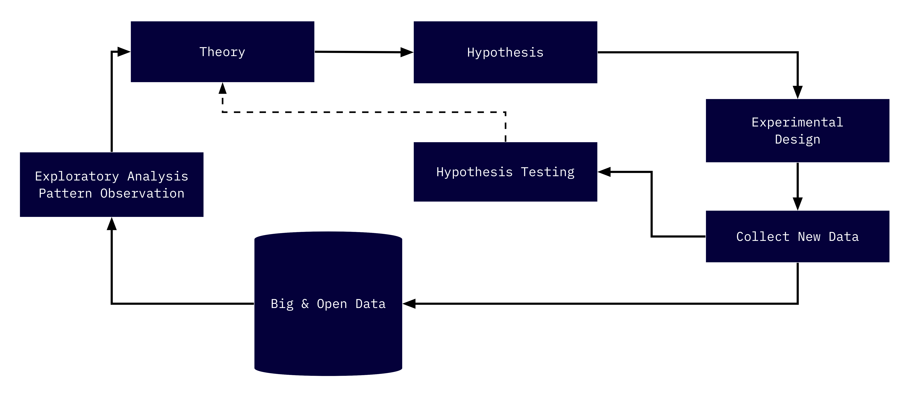

# Approaches to and Schools of Urban Informatics 

```{r, include=FALSE}
source("common.R")
```

## Scientific approaches

In the sciences generally, there are two approaches to scientific inquiry: inductive and deductive. These two approaches can be best characterized as “bottom up” and “top down” respectively. Each has their own origins, strengths, and weaknesses. An argument has been raging—in the scientific sense of raging—since the 17th century about which approach is the best one. My answer to this? Both, and neither. And you’ll see why shortly. 

Let’s start by getting a grasp on deductive approaches (also referred to as deduction). With deduction we start with a theory about the workings of some observed phenomenon. From this theory, we create a hypothesis, then observe (or collect data on) the phenomenon. With this data we then confirm or refute our theory. This is how we all have, most likely, been taught about the scientific method. 

Induction works in a reverse order. It works by looking at the natural world and doing just that, looking. It works by noticing something—a pattern, a unique occurrence—then noticing it again, and then again, and then under slightly different conditions. From those observations, we draw hypothesis. We then observe yet again and see if we can refute or add a little bit more credibility to our findings. Then from doing this time and again, we can build a theory. It’s somewhat like Sherlock and Watson finding clues and then coming to (frighteningly specific) conclusions. These theories, no matter how we get there, are the frameworks that we use to try and explain phenomena that we see. 

## The Chicago School

Much of what is known as the urban sciences today can be traced back to the late 19th and early 20th centuries at the University of Chicago. The University of Chicago was at the time the epicenter of the new field of American Sociology which came to be known as the Chicago School. In that era, the social sciences were seeking to create grand theories of the world. Take, for example, the new field of Anthropology that crafted theories about the origins of the human race. The Chicago School "fostered a very different view of sociology: first-hand data collection was to be emphasized; research on the particular case or setting was to be stressed; induction over deduction was to be promoted"[^turner]. 

Scholars such as Robert Park, Ernest Burgess, and Louis Wirth developed a number of micro-theories to understand the city. Most notably is the culminating work The City by Park and Burgess, a collection of essays that encapsulate decades of careful observation that led to a number of theories that still have influence today. Their body of work, important in so many ways, is an early paragon of an inductive approach to social research. 

## Complexity and Santa Fe Institute 

On the other end of the spectrum rest the Santa Fe Institute (SFI) and their complexity science. The SFI's mission is to "endeavor to understand and unify the underlying, shared patterns in complex physical, biological, social, cultural, technological, and even possible astrobiological worlds."[^complexity] Crudely, it is their goal to unify theory into one general master theory. Central to their theoretical focus is the the view that "valuable ideas are often confined to the echo chambers of academia."[^complexity] In this view, they are not wrong. 

Their work is important for bridging many so called gaps between disciplines. They apply biological theories of scaling to those of human development. And their findings have been fruitful! Their focus on the interconnectivity of theory of both the natural and social worlds is in some ways the messy work that must be done. This too is in the spirit of the Chicago School as illustrated by it's view of the City as an organism. 

## A Hybrid Approach 

As part of this proliferation of big data we have more and better data within reach. As such we are able to, perhaps even encouraged to, take a much more hybrid approach. Within the these data are a multitude of opportunities to explore and glean patterns that we may have been so subtle that it hasn't been observed before. Or, alternatively, the data had not been collected before. This allows us to take a much more inductive approach where we can craft theories from the patterns that we observe, then we can test those theories in creative ways. It is here where, I believe, that the Boston Area Research Initiative (BARI) rests on the spectrum. This hybrid methodology incorporates both inductive and deductive approaches.



The above graphic is m best attempt to illustrate this hybrid model. We start with data. We use publicly available (open) administrative data to explore. We get our metaphorical hands dirty with the data. After we munge it, transform it, and rearrange it, we will walk away with some tidbit of information. From that we discover more. And at the end of the day we develop a theory—a framework for understanding what we have observed. Next, we then develop a hypothesis using that new theory and apply it to some other set of data or some new circumstance to test and refine the theories we have developed. In this we both create theory from observation, and test those theories on new and unexplored observations. 

Dan O'Brien, Director of BARI, claims to track more with the Chicago School in their approach—and this is correct. But, BARI also actively seeks to evaluate existing theory. There are no better examples of the BARI approach than the development and use of **ecometrics** to understand the City and test existing theory.

In the next chapter we will learn about ecometrics, their origins, and their use in evaluating the prominent crimoinological _Broken Windows_ theory. 


[^turner]: Turner, Jonathan H. ["The mixed legacy of the Chicago school of sociology."](https://journals.sagepub.com/doi/10.2307/1389202) Sociological perspectives 31, no. 3 (1988): 325-338.
[^complexity]: [Santa Fe Institute](https://www.santafe.edu/about)