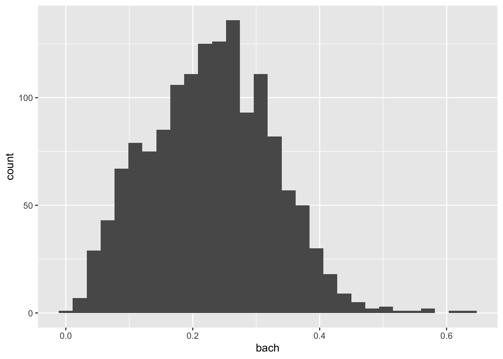

# Visual Analysis 


## Data Exploration

- introduce you to the data analysis workflow and exploratory data analysis
- in R for Data Science Garret Grolemund and Hadley Wickham define data exploration as:

> Data exploration is the art of looking at your data, rapidly generating hypotheses, quickly testing them, then repeating again and again and again. 

- exploratory data analysis is done generally when your data were not collected as part of an experiment
-  EDA is used for inductive scientific inquiry
- we do not necessarily know what we are looking for at the outset
- or we may have an idea of what is available to us
- generally when we are performing exploratory data analysis, we did not partake too greatly in the data collection process
- however, even if your data are the result of an experiment, you may we want to dig into it further. You never know what you may find. You may find the seedling that sprouts into your next experiment

- below is an image from R for Data Science which accurately describes the data exploration process
- there are 6 steps in this illustration, 3 of which happen in a cyclical process


- this chapter focuses on visualizing our data
- visualization is key for this process.
- An older National Institute of Standards and Technology (NIST) statistical manual contains this gem

> The reason for the heavy reliance on graphics is that by its very nature the main role of EDA is to open-mindedly explore, and graphics gives the analysts unparalleled power to do so, enticing the data to reveal its structural secrets, and being always ready to gain some new, often unsuspected, insight into the data. In combination with the natural pattern-recognition capabilities that we all possess, graphics provides, of course, unparalleled power to carry this out.

[source](https://www.itl.nist.gov/div898/handbook/eda/section1/eda11.htm)

## The American Community Survey 

- we'll work with data from the american community survey. 
  - this is data you will get really familiar with 
- what is the acs and why do we love it?
  - https://www.vox.com/explainers/2015/12/3/9845152/acs-survey-defunded
  - random sample of individuals across the us 
    - random samples are used as they representative and statistically non-biased
  - the information is used to determine funding
  - tells us about age, ethnicity, country of origin, occupation, education, voting behavior, etc.
  - this information is available in the decennial census (in the constitution)
  - ACS tells us about rates rather than the actual number of people in a thing
  - one of the major problems is that some populations are under-represented
    - https://prospect.org/economy/insidious-way-underrepresent-minorities/
    


> What is the relationship between education and income?

we have a data frame loaded 
this is very similar to a table in excel
each column is a variable


```r
acs_edu
## # A tibble: 1,456 x 7
##    med_house_income less_than_hs hs_grad some_coll  bach white   black
##               <dbl>        <dbl>   <dbl>     <dbl> <dbl> <dbl>   <dbl>
##  1           105735       0.0252   0.196     0.221 0.325 0.897 0.0122 
##  2            69625       0.0577   0.253     0.316 0.262 0.885 0.0171 
##  3            70679       0.0936   0.173     0.273 0.267 0.733 0.0795 
##  4            74528       0.0843   0.253     0.353 0.231 0.824 0.0306 
##  5            52885       0.145    0.310     0.283 0.168 0.737 0.0605 
##  6            64100       0.0946   0.294     0.317 0.192 0.966 0.00256
##  7            37093       0.253    0.394     0.235 0.101 0.711 0.0770 
##  8            87750       0.0768   0.187     0.185 0.272 0.759 0.0310 
##  9            97417       0.0625   0.254     0.227 0.284 0.969 0.00710
## 10            43384       0.207    0.362     0.262 0.124 0.460 0.105  
## # … with 1,446 more rows
```

we can visualize the relationship to get a better understanding. we can look at income and college grad rates

start building a visualization with `ggplot()` **function** with the `acs_edu` **object**.
Functions are characterised by the parentheses at the end of them. Functions do things. Objects hold information. 


```r
ggplot(acs_edu)
```


we add to this plot
determine what we want to plot with the aesthetics `aes()` function inside of the ggplot(). 
want to specify x and y. These are called arguments. To set argument we use the `=` sign.
set `x` to `bach` and `y` to `med_house_income`


```r
ggplot(acs_edu, aes(x = bach, y = med_house_income))
```


- notice how the plot is being filled a bit more?
- now we need to specify what type of plot we will be creating. 
- add geometry, or geoms. We use the plus sign `+` to signify that we are adding on top of the basic graph
- there are many different kinds of charts we can use we will get into these a bit more later.
- a common way of visualizing a relationship between two variables is with a scatterplot 
- a scatter plot graphs points for each x and y pair. you've likely made a few of these in your primary education
- to add points to the graph we use `geom_point()`, remember, we are _adding_ a layer so we use the plus sign
- for legibility we add each new layer on a new line. R will indent for you. Good style is important. We'll get into this later


```r
ggplot(acs_edu, aes(x = bach, y = med_house_income)) +
  geom_point()
```


- notice that there is a positive linear trend. 
- lets break that down:
  - when the point point up to the right, that is positive, down to the left is negative. 
    - for each unit we go up on the x (bach) we tend to go up on the y (hh income)
  - linear means it resembles a line
- what are we looking for in a scatter plot?
  - we're looking for low variation and a consistent pattern or line
  - we want the points to be very close
  - imagine we drew a line going through the middle of the points, we'd want each point to be either on that line or extremely close. if the line is further away, that means there is a lot more variation
- to finish this up we can add some informative labels
- we will add a labels layer with the function `labs()`
- give them more legible labels. we will give each axis a better name and give the plot a title
- the arguments we will set to the labs function are `x`, `y` and `title`. Rather intuitive, huh?
  - x = "% of population with a Bachelor's Degree"
  - y = "Median Household Income"
  - title = "Relationship between Education and Income"
- note that for each argument I have a new line. again, this helps with legibility


```r
ggplot(acs_edu, aes(x = bach, y = med_house_income)) +
  geom_point() +
  labs(x = "% of population with a Bachelor's Degree",
       y = "Median Household Income",
       title = "Relationship between Education and Income")
```


- what can we determine from this graph?
- in the sociology literature there is a lot about the education gap between white and black folks
- can we see this in a graph?
- we can modify our existing plot to illustrate this too. 
- we can map the % white to the color of the chart
- we add to this within the aesthetics. The `aes()`thetics is where we will determine things like size, group, shape, etc.
- set the `color` argument to the `white` column
- while we're at it, we can add a subtitle to inform that we're also coloring by % white


```r
ggplot(acs_edu, aes(x = bach, y = med_house_income, color = white)) +
  geom_point() +
  labs(x = "% of population with a Bachelor's Degree",
       y = "Median Household Income",
       title = "Relationship between Education and Income",
       subtitle = "Colored by whiteness") 
```



- what can we conclude now?


-------


#### Misc Notes:

- this chapter is to introduce the concept of exploratory data analysis
  - this should be done at a later point


- NIST EDA: https://www.itl.nist.gov/div898/handbook/eda/section1/eda11.htm
- https://r4ds.had.co.nz/explore-intro.html
- iteration 
- this chapter focuses on visualization
- the process of exploratory anlaysis is naturally inductive

