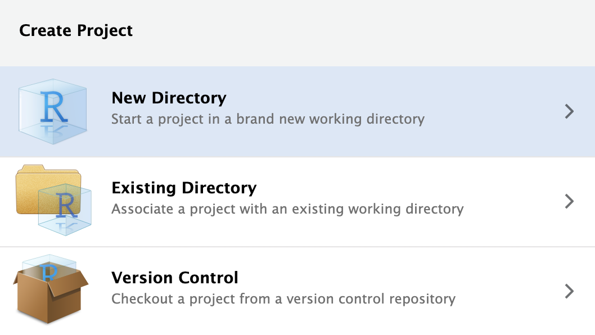
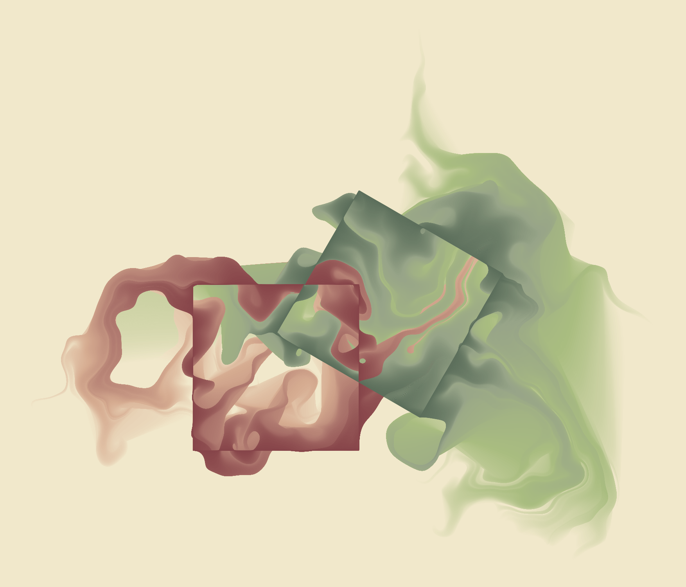

# The basics 

## What is R and why do I care?

What is R? R is the 18th letter of the alphabet, the fourth letter in _QWERTY_—like the keyboard—and, most importantly, R is a software package for statistical computing. 

First, a brief history lesson. R is a descendant of the S statistical programming language whose naissance can be traced back to 1976 in Bell Laboratories[^s]. As S developed, people sought to commercialize the language. In 1993, the license as well as development and selling rights were given to a private company. From then on, and what is still the case today, S became available only as the commercialized S-PLUS[^martin]. 

Later, seeing a need for an improved statistical software environment, two researchers from the University of Auckland created a new statistical programming language, this became known as R. R was developed in the image of S. However, one important early decision to make the R-project free and open source changed its fate dramatically. 

Today, the R-project is developed and maintained by a group known as the R Core who "represent multiple statistical disciplines and are based at academic, not-for-profit and industry-affiliated institutions on multiple continents"[^sdlc]. They define R as below. 

> R is an integrated suite of software facilities for data manipulation, calculation and graphical display.[^rproj]


To simplify it, R can be thought of as a fancy calculator. R was designed to do math, specifically statistics. R was designed to be extended to incude further capabilities than just statistics. Indeed it has been. While R is for all intents and purposes a programming language, one should, in theory, feel like they are doing data analysis and not programming[^s].

R is unique from other commercial statistical software such as stata and SPSS. Very fundamentally, R is a free project. While it is monetarily free, free refers to "liberty, not price"[^gnu]. In order to truly understand the adventure you will be embarking on shortly, I think it is important you familiarize yourself with the four freedoms of free software. These are:

> 1. The freedom to run the program as you wish, for any purpose (freedom 0).

> 2. The freedom to study how the program works, and change it so it does your computing as you wish (freedom 1). Access to the source code is a precondition for this.

> 3. The freedom to redistribute copies so you can help others (freedom 2).

> 4. The freedom to distribute copies of your modified versions to others (freedom 3). By doing this you can give the whole community a chance to benefit from your changes. Access to the source code is a precondition for this. [^gnu]

These freedoms are a large part of the success of R as a language. Because of the free nature of R, academics and industry experts from around the globe are contributing to the language. This means that many new statistical techniques are first implemented in R. 

The contributions that people make to R are changing the ways in which people perform data analysis. Because of this, we need to start contextualizing the tooling we use as **part of** the scientific process—not apart from it. When you engage in your analyses and work on contribute to the vast body of scientific literature, remember that without the tools you are using, much of it would not be possible. When you engage in science, think to yourself how you are adhering to the four essential freedoms. Are you enabling others to do with your findings as they wish? Will your research be accessible to the greater community? What will you do to "give the whole community a chance to benefit from your [work]?

## The RStudio IDE

When R is downloaded, interacting with it is somewhat of a cumbersome process. While some people love it, it can feel like programming in the matrix.

For this reason, we will use RStudio to program in R. RStudio is an integrated development environment (IDE). This means that most of the features that you will need to develop in R will all be in one place. RStudio gives you a place to write your R code, execute it, view the awesome graphics you produce, and much more. 

I like to think of R as typesetting a printing press and using RStudio like using Mircrosoft word. Chester Ismay and Albert Kim's Modern Dive, provide another excellent analogy of R and RStudio. They describe R as the engine of a car, and RStudio as the dashboard[^md].

Let's get familiar with RStudio. You need to know where you are when working within RStudio. There are 4 quadrants that we work with (called panes). 


The above graphic is borrowed from RStudio, PBC's Thomas Mock's Introduction to the Tidyvers[^jtm] 

### The Editor

The editor. The top left pane. This is where you will actually write your code. You will see in the image above that there is tab with the name of the R file being edited, `mpg-plot.R`. The simplest way in which R code is written, is in documents with the `.R` extention. Think of the R script as your word document. This is where you put the writing that you want to keep. 

There is also a second type of R file called an RMarkdown document, `.Rmd`s. These are a special type of file that lets us intersperse regular prose with code chunks. Rmd is extremely flexibile and enabled the user to render their content in many different formats such as a pdf, powerpoint, html, and others. For example, this book is written with RMarkdown. But, to keep things simple, we will use R scripts for the vast majority of this book, plus they're my favorite way to interact with R. 

### The console

Let us now avert our attention to the bottom left pane. This is known as the console. The console is where your R code is actually execute. When you run a line or chunk of code from your editor, you will see it processed in the console. I often treat my console as my scratch paper. This is a place where I can explore R objects and code without affecting the primary R file. You should become comfortable typing your R code in the editor and see it executed in the console.  

### Output

Now moving over to the right. This is the most versatile quadrant of RStudio. You will primarily use this quadrant to look at things. There is a pane for navigating your files, looking at help documentation, viewing the charts that you produce, and any interactive applications you may develop. 

## Installing R & RStudio 

Now that you are somewhat familiar with R and RStudio, it is time to install them. I recommend installing R _and then_ RStudio. 

R can be downloaded from the **C**entral **R** **A**rchival **N**etwork (CRAN). CRAN is the official location for all things R. CRAN provides access to the R software, license, copyright, and software extensions (called R packages). Go to [CRAN](https://cran.r-project.org/) to download R[^cran]. 

RStudio is provided by RStudio, Public Benefit Corporation (RStudio, PBC). To install RStudio navigate to the [download page](https://rstudio.com/products/rstudio/download/#download)[^download]. 
Once both have been installed you can open RStudio to get started. Look for the circular R logo. If you get lost navigating the RStudio IDE, be sure to refer to the [cheat sheet](https://github.com/rstudio/cheatsheets/raw/master/rstudio-ide.pdf). 


## Preventative Care

### R Projects

Once you open up RStudio you will be able to get rocking and rolling. Though, I want to instill some best practices from the get go. This following section will save you and anyone who you collaborate with an undescribable amount of headaches. 
Folks are tempted to open up RStudio and begin doing analysis. That is all well and good though this leads to many problems. We need to contextualize each and every analysis as it's own **project**. Currently I mean project in the conceptual manner. If there is a common overarching theme, intent, or purpose, that analysis should be delineated as its own project and should be identifiable from others. 

You probably already have a notion of projects implemented in your life. Consider your school work. I suspect, and frankly hope, that you have a somewhat organized folder structure where each semester is its own folder, and each course is its own folder within that. An example of what some of my folder organization looks like is below. 

```
fall/
  big-data-for-cities/
    projects/
  urban-theory/
    literature/
  
spring/
  info-design/
    data/
  intro-data-mining/
```

In the above case we would consider each course as its own project. The important thing to keep in mind here is that each project is self-contained. By working inside of self-contained folders we can ensure that there are no problems with accessing files. R uses the concept of a working directory. Think of the working directory as "where do I start when I am looking for things?"

Imagine R is using the working directory `spring` but you are working on your `info-design` work. Conceptually, you feel as if you're working from the `info-design` folder, but R is actually under the impression you are working from `spring`. So when you try to load some data from the `data` folder inside of `info-design` (which looks like `info-design/data`), you have to tell R how to get there. And the way R would get there is probably different than you think at the time.

To prevent this, we can essentially level set with R by creating a project. An R project gently imposes the standalone structure that we will need to prevent most of the headaches described above. 

The way to create a new project is by navigating to `File > New Project`.




Click `New Directory`. This will create a new folder for you. Next, RStudio will prompt you to specify what kind of project to create. Today, that will be a generic `New Project`. In the future, I suspect you will end up creating Shiny applications and much more. 


The final step is to specify what the project will be called and where to put it. In the below image I name the new directory `uitk`, short for _Urban Informatics Toolkit_, and place it in the directory `R`. Be sure to select which folder you want your project to live in. 

A few tips:

- Think about where you will be able to find the project again
- Where would it make the most sense for the project to live?
- **Do not** put spaces or periods in the directory name. Use `_` or `-` if you feel the need. 


This will open up a new RStudio session. You will notice in your `Files` pane that there is now a `uitk.Rproj` file there. That file is what tells RStudio about the project, so don't delete it! If you would like to open up an RStudio project you can either open the `.Rproj` file from your file navigator or open it by following `File > Open Project`. 

### The data

In order to complete the exercises throughout this book you will need to have the data accessible to you. You can download the data [here](https://github.com/JosiahParry/urban-informatics-toolkit/raw/master/data.zip)[^data]. This link will download a file called `data.zip`. Once downloaded open the file. It will create a folder called `data`. Move that entire folder into your new project. If you created a project called `uitk` in the `R` directory, move the folder to `~/R/uitk`. This will create a folder path of `~/R/uitk/data`. 

### Your Workspace

In another effort to impose good habits and reproducibility standards I will suggest you change one setting in RStudio. Navigate to `Tools > Global Options` now change the below setting.


This setting makes it so that your analysis is dependent upon the code you write, not the things you create while interactively programming. A general rule of thumb is that your R script should be able to run from top to buttom successfully.


## Before we embark

Lastly, I want to emphasize that R and RStudio can be used for so much more than statistical analysis. It can be used to make aRt. 

<a href="https://www.data-imaginist.com/art">
  
</a>

It can be used to make beautiful graphics for the BBC.


 
R can be found in the infrastructure of our modern world. R is utilized in our global financial institutions, civil rights groups such as the ACLU, investigative journalism, national defense, and so much more. Do not feel that the _only_ thing you will get from learning R is how to do some simple statistics. 

## Getting Help 

Undoubtedly you will run into problems when programming and you're going to want or need help. If you don't know where to go, getting help may feel impossible. There are two main places that I recommend you go to for help when you encounter problems: Stack Overflow and RStudio community. 

[Stack Overflow](https://stackoverflow.com) is one piece of the large Stack Exchange network that is dedicated strictly to programming issues[^so]. There is a good chance that you've encountered Stack Exchange at some point in your various google searches. Stack Exchange is a network that is strictly dedicated to a question and answer format. Each topic has their own subdomain. For those who are unfamiliar, think of Stack Exchange like Reddit where each subreddit is their own own Q&A page. And for those who are unfamiliar with Reddit, think of Stack Overflow like Yahoo! Answers or Quora. Stack Overflow has a huge database of questions and answers for all of the programming problems that folks have encountered. It is very unlikely to have a question that has not been answered on Stack Overflow before. 

The [RStudio Community](https://community.rstudio.com/) page is a community forum created by RStudio[^community]. This is a location for members of the R community—which you can now count yourself a part of—to ask questions, engage in thoughtful dialogue, and much more. While Stack Overflow is committed to all programming languages, of which R is just one of them, the RStudio Community is maintained entirely by R users.

If you have never asked a technical question before I would recommend spending doing so on RStudio Community as Stack Overflow has a [history](https://meta.stackoverflow.com/questions/262791/the-rudeness-on-stack-overflow-is-too-damn-high) of somewhat rude community[^hist]. Before you do so, be sure to create a [**rep**roducible **ex**ample](https://www.tidyverse.org/help/#reprex) so that the community can best help you[^reprex]. 

## Reminders 

Learning to program can be exceptionally difficult and frustrating at times. It can be a roller coaster of emotions. It is expected that you will not understand everything the first go around. Do not get down on yourself. I encourage you to take breaks and not push yourself too hard or even be self-critical. I understand you have deadlines, but sometimes it is better if you take a break, eat a healthy snack, go exercise, sleep, be social, or do whatever makes you happy and then come back. You will be much happier and your work will be even better and that I promise you! 

If you ever find yourself in a bout of programming induced frustration try one of the below:

* Drink water! Just do this even if you don't feel like it. Water is always good. 
* Get some sleep. Without sleep you wil be running at 60% or less. 
* Eat your greens. You are what you eat! 
* Shower. Feeling clean can change your perspective and approach. 
* Get your blood flowing! Go for a walk. Do some squats or pushups. Making sure your blood is moving is important. 
* And take care of yourself!

Now, let's get going.

[^s]: The S System. John Chambers. https://web.archive.org/web/20181014111802/http://ect.bell-labs.com/sl/S/.
[^martin]: Statistical Sciences, Inc. Douglas Martin. 1996. https://github.com/JosiahParry/r-history/raw/master/lit/S/statsci-splus-death.pdf.
[^sdlc]: R: Software Development Life Cycle. A Description of R’s Development, Testing, Release and Maintenance Processes. March 25, 2018. The R Foundation for Statistical Computing c/o Institute for Statistics and Mathematics https://www.r-project.org/doc/R-SDLC.pdf.
[^rproj]: The R Project. https://www.r-project.org/about.html.
[^gnu]: GNU. https://gnu.org.
[^md]: Modern Dive. https://moderndive.com/1-getting-started.html.
[^download]: RStudio IDE Download. https://rstudio.com/products/rstudio/download/#download.
[^cran]: CRAN. https://cran.r-project.org/.
[^hist]: The Rudeness on Stack Overflow is Too Damn High. https://meta.stackoverflow.com/questions/262791/the-rudeness-on-stack-overflow-is-too-damn-high.
[^so]: Stack Overflow. https://stackoverflow.com.
[^reprex]: Reproducible Examples. https://www.tidyverse.org/help/#reprex.
[^community]: RStudio Community. https://community.rstudio.com/.
[^jtm]: Intro to RMarkdown. Thomas Mock. https://github.com/jthomasmock/intro-tidyverse/blob/master/intro-to-tidyverse.rmd.
[^data]: Urban Informatics Toolkit Data. https://github.com/JosiahParry/urban-informatics-toolkit/raw/master/data.zip
