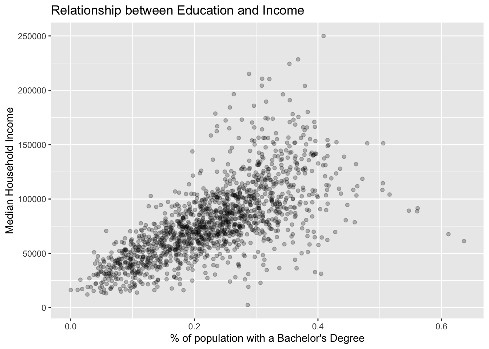

# Reading data


We spent the last chapter performing our first exploratory visual analysis. From our visualizations we were able to inductively conlcude that as both median household income and the proportion of the population with a bachelors degree increases, so does the share of the population is white. This is a finding we will work to address empirically at a later point.

While we were able to make wonderful visualizations, we did skip a number of steps in the exploratory analysis process! Arguably most importantly we skipped the importing of our datasets. The ACS dataset was already loaded into R for you. This almost always will not be the case. As such, we're going to spend this chapter learning about some of the common data formats that you will often work with. 

{ image of the visualization step }


## Background

There are three general sources where we as social scientists will recieve or access data: 1) text files, 2) databases, and 3) application programming interfaces (APIs). Frankly, though this is the age of "big data," we are not always able to interface directly with these sources. But through partnership efforts between the public and private we able to share data. For example, BARIs work with the Boston Police Department provides them with annual access to crime data. But BARIs access is limited. They do not have credentials to log in to the database and perform their own queries. What they are usually presented with is a flat text file(s) that contains the data requisite for analysis. And this is what we will focus in this chapter. 

Flat text files will be sufficient for 85% of all of your data needs Now, what do I mean by _flat text file_? A flat text file is a file that stores data in plain text—I know, this seems somewhat confusing. In otherwords, you can open up a text file and actually read the data with your own eyes or a screenreader. For a long while tech pundits believed—and some still do—that text data will be a thing of the past. Perhaps this may be true in the future, but plain text still persists and there are some good reasons for that. Since plain text is extremely simple it is lightweight and usually does not take up that much memory. Also, because there is no fancy embelishing of the data in a plain text file, they can be easily shared from machine to machine without concern of dependent tools and software. Not to mention that we humans can actually be rather hands on and inspect the source of the data ourselves.

## Actually Reading Data

Within the `tidyverse` there is a package called [`readr`](https://readr.tidyverse.org) which we use for reading in rectangular data from text files.

> Aside: I am still unsure if it is pronounced _read-arr_ or _read-er_. So just do your best. 

I just threw the phrase _rectangular data_ at you. It is only fair to actually describe what that means. If you were to look at rectangular data in something like excel it would resemble a rectangle. In fancy speak, rectangular data is a _two-dimensional_ data structure with rows and columns. We will learn more about the "proper" way to shape rectangular data in the "tidying data" chapter. For now, all you need to know is that there are rows and columns in rectangular data. 

To get started, let us load the tidyverse. This will load readr for us. 


```r
library(tidyverse) 
```

You most likely have seen and encountered flat text files in the wild inthe form of a `csv`. It is important to know what _csv_ stands for because it will help you understand what it actually is. it stands for **c**omma **s**eparated **v**alues. _csv_s are a flat text data file where the data is rectangular! Each new line of the file indicates that there is a new row. Within each row, each comma indicates a new column. If you opened one up in a text editor like text edit or notepad a csv would look something like below.

```
column_a, column_b, column_c,
10, "these are words", .432,
1, "and more words", 1.11
```

To read a csv we use the `readr::read_csv()` function. `read_csv()` will read in the csv file and create a `tibble`. A tibble is type of a data structure that we will be interacting with the most throughout this book. A tibble is a rectangular data structure with rows and columns. Since a csv contains rectangular data, it is natural for it to be stored in a tibble.

> Note: the syntax above is used for referencing a function from a namespace (package name). The syntax is pkgname::function(). This means the `read_csv()` function from the package `readr`. This is something you will see frequently on websites like [StackOverflow](https://stackoverflow.com/questions/tagged/r).

Have a look at the arguments of `read_csv()` by entering `?read_csv()` into the console. You will notice that there are many arguments that you can set. These are there to give you a lot of control over how R will read your data. For now, and most of the time, we do not need to be concerned about these extra arguments. All we need to do is tell R _where_ our data file lives. If you haven't deduced from the help page yet, we will supply only the first argument `file`. This argument is _either a path to a file, a connection, or literal data (either a single string or a raw vector)_.

> Note: When you see the word _string_, that means values inside of quotations—i.e. _"this is a string"_.

We will read in the dataset that was already loaded in the first chapter. These data are stored in the file named `acs_edu.csv`. We can try reading this as the file path.


```r
read_csv("acs_edu.csv")

## Error: 'acs_edu.csv' does not exist in current working directory 
##   ('/Users/Josiah/GitHub/urban-commons-toolkit').
```

Oops. We've got red text and that is never fun. Except, this is a very important error message that, frankly, you will get **a lot**. 

Again it says:

> _Error: 'acs_edu.csv' **does not exist** in current **working directory**_

I've bolded two portions of this error message. Take a moment to think through what this error is telling you. 

For those of you who weren't able to figure it out or just too impatient (like myself): this error is telling us that R looked for the file we provided `acs_edu.csv` but it could not find it. This usually means to me that I've either misspelled the file name, or I have not told R to look in the appropriate folder (a.k.a. directory). 

`acs_edu.csv` actually lives in a directory called `data`. To tell R—or any computer system, really—where that file is we write `data/acs_edu.csv`. This tells R to first enter the `data` directory and then look for the `acs_edu.csv` file. 

Now, read the `acs_edu.csv` file!


```r
read_csv(file = "data/acs_edu.csv") 
#> Parsed with column specification:
#> cols(
#>   med_house_income = col_double(),
#>   less_than_hs = col_double(),
#>   hs_grad = col_double(),
#>   some_coll = col_double(),
#>   bach = col_double(),
#>   white = col_double(),
#>   black = col_double()
#> )
#> # A tibble: 1,456 x 7
#>    med_house_income less_than_hs hs_grad some_coll  bach white   black
#>               <dbl>        <dbl>   <dbl>     <dbl> <dbl> <dbl>   <dbl>
#>  1           105735       0.0252   0.196     0.221 0.325 0.897 0.0122 
#>  2            69625       0.0577   0.253     0.316 0.262 0.885 0.0171 
#>  3            70679       0.0936   0.173     0.273 0.267 0.733 0.0795 
#>  4            74528       0.0843   0.253     0.353 0.231 0.824 0.0306 
#>  5            52885       0.145    0.310     0.283 0.168 0.737 0.0605 
#>  6            64100       0.0946   0.294     0.317 0.192 0.966 0.00256
#>  7            37093       0.253    0.394     0.235 0.101 0.711 0.0770 
#>  8            87750       0.0768   0.187     0.185 0.272 0.759 0.0310 
#>  9            97417       0.0625   0.254     0.227 0.284 0.969 0.00710
#> 10            43384       0.207    0.362     0.262 0.124 0.460 0.105  
#> # … with 1,446 more rows
```


This is really good! Except, all that happened was that the function was ran. The data it imported was not saved anywhere which means we will not be able to interact with it. What we saw was the output of the data. In order to interact with the data we need to assign it to an object.

> Reminder: we assign object with the assignment operator `<-`—i.e. `new_obj <- read_csv("file-path.csv")`. Objects are things that we interact with such as a tibble. Functions such as `read_csv()` _usually_, but not always, modify or create objects. 


In order to interact with the data, let us store the output into a tibble object called `acs`. 


```r
acs <- read_csv(file = "data/acs_edu.csv") 
```

Notice how now there was no data printed in the console. This is a good sign! It means that R read the data and stored it properly into the `acs` object. When we don't store the function results, the results are (usually) printed out. To print an object, we can just type it's name into the console. 


```r
acs
#> # A tibble: 1,456 x 7
#>    med_house_income less_than_hs hs_grad some_coll  bach white   black
#>               <dbl>        <dbl>   <dbl>     <dbl> <dbl> <dbl>   <dbl>
#>  1           105735       0.0252   0.196     0.221 0.325 0.897 0.0122 
#>  2            69625       0.0577   0.253     0.316 0.262 0.885 0.0171 
#>  3            70679       0.0936   0.173     0.273 0.267 0.733 0.0795 
#>  4            74528       0.0843   0.253     0.353 0.231 0.824 0.0306 
#>  5            52885       0.145    0.310     0.283 0.168 0.737 0.0605 
#>  6            64100       0.0946   0.294     0.317 0.192 0.966 0.00256
#>  7            37093       0.253    0.394     0.235 0.101 0.711 0.0770 
#>  8            87750       0.0768   0.187     0.185 0.272 0.759 0.0310 
#>  9            97417       0.0625   0.254     0.227 0.284 0.969 0.00710
#> 10            43384       0.207    0.362     0.262 0.124 0.460 0.105  
#> # … with 1,446 more rows
```

This is sometimes a little overwhelming of a view. For previewing data, the function `dplyr::glimpse()` (there is the namespace notation again) is a great option. Try using the function `glimpse()` with the first argument being the `acs` object.


```r
glimpse(acs)
#> Rows: 1,456
#> Columns: 7
#> $ med_house_income <dbl> 105735, 69625, 70679, 74528, 52885, 64100, 37093, 87…
#> $ less_than_hs     <dbl> 0.02515518, 0.05773956, 0.09364548, 0.08426318, 0.14…
#> $ hs_grad          <dbl> 0.19568768, 0.25307125, 0.17332284, 0.25298192, 0.31…
#> $ some_coll        <dbl> 0.2211696, 0.3157248, 0.2726736, 0.3534052, 0.283073…
#> $ bach             <dbl> 0.32473048, 0.26167076, 0.26677159, 0.23124279, 0.16…
#> $ white            <dbl> 0.8972737, 0.8849885, 0.7328322, 0.8235779, 0.737102…
#> $ black            <dbl> 0.012213740, 0.017090069, 0.079514240, 0.030640286, …
```

### Exercise

Recreate a plot from the previous chapter using our newly imported `acs` tibble object. 


```r
ggplot(acs, aes(x = bach, y = med_house_income)) +
  geom_point(alpha = 0.25) +
  labs(x = "% of population with a Bachelor's Degree",
       y = "Median Household Income",
       title = "Relationship between Education and Income") 
```




## Other common data formats

While csv files are going to be the most ubiquitous, you will invariably run into other data formats. The workflow is almost always the same. If you want to read excel files, you can use the function `readxl::read_excel()` from the [`readxl`](https://readxl.tidyverse.org/) package. 


```r
acs_xl <- readxl::read_excel("data/acs_edu.xlsx")
glimpse(acs_xl)
#> Rows: 1,456
#> Columns: 7
#> $ med_house_income <dbl> 105735, 69625, 70679, 74528, 52885, 64100, 37093, 87…
#> $ less_than_hs     <dbl> 0.02515518, 0.05773956, 0.09364548, 0.08426318, 0.14…
#> $ hs_grad          <dbl> 0.19568768, 0.25307125, 0.17332284, 0.25298192, 0.31…
#> $ some_coll        <dbl> 0.2211696, 0.3157248, 0.2726736, 0.3534052, 0.283073…
#> $ bach             <dbl> 0.32473048, 0.26167076, 0.26677159, 0.23124279, 0.16…
#> $ white            <dbl> 0.8972737, 0.8849885, 0.7328322, 0.8235779, 0.737102…
#> $ black            <dbl> 0.012213740, 0.017090069, 0.079514240, 0.030640286, …
```

Another common format is a **tsv** which stands for **t**ab **s**eparated **f**ormat. `readr::read_tsv()` will be able to assist you here. 

If for some reason there are special delimiters like `|`, the `readr::read_delim()` function will work best. For example `readr::read_delim("file-path", delim = "|")` would do the trick!

Additionally, another extremely common data type is _json_ which is short for javascript object notation. json is a data type that you will usually not read directly from a text file but interact with from an API. If you do happen to encounter a json flat text file, use the `jsonlite` package. `jsonlite::read_json()`. 

In the next chapter we will begin to work with [`dplyr`](https://dplyr.tidyverse.org) and start getting hands on with our data. 


