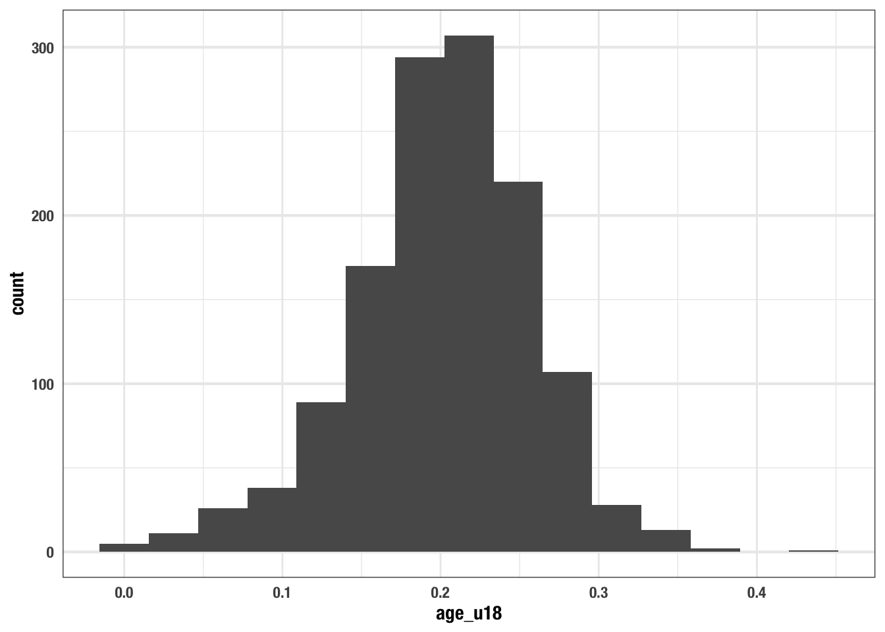
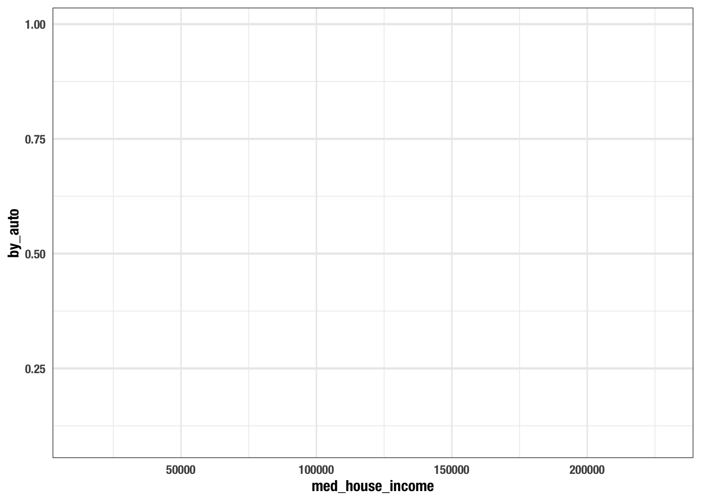
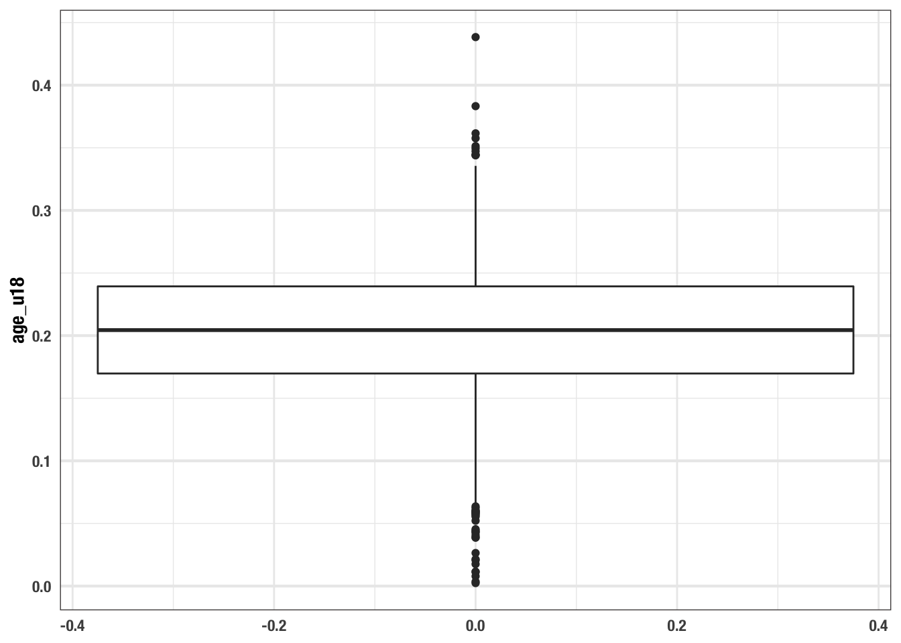
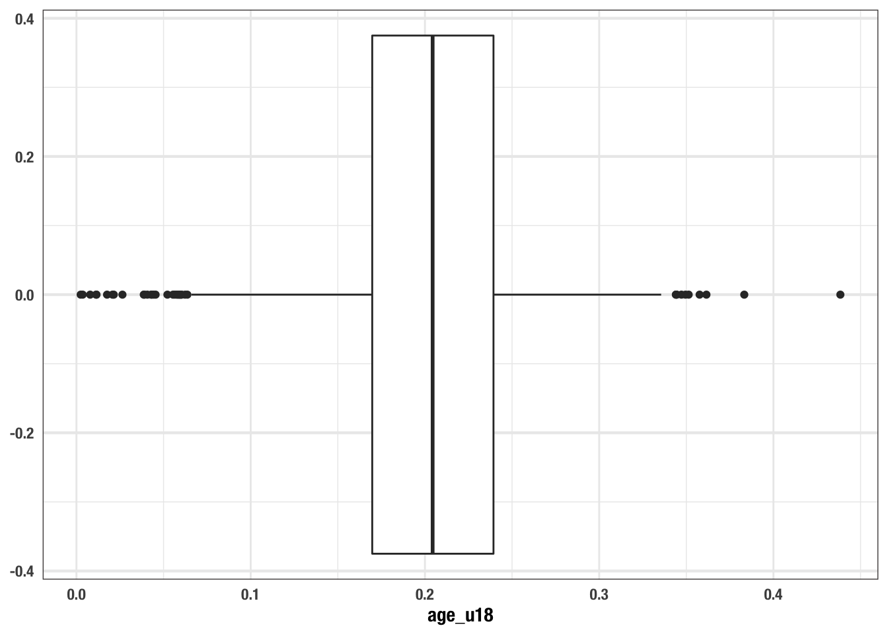
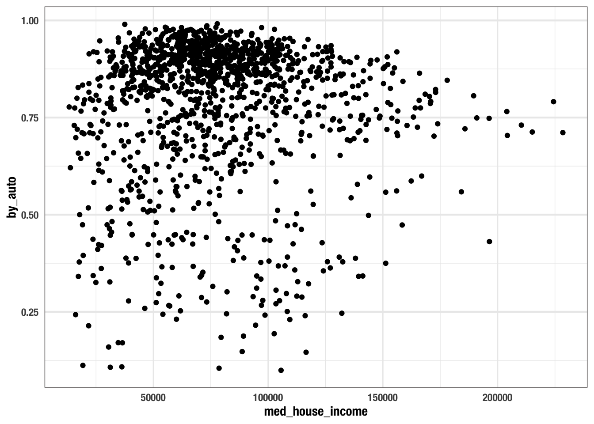
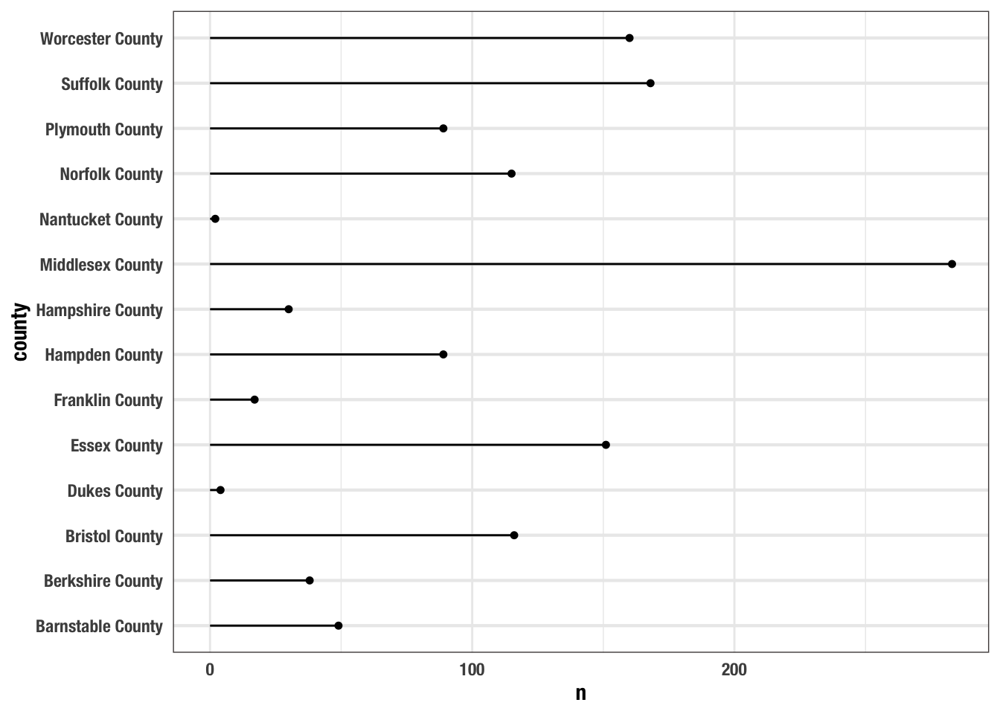
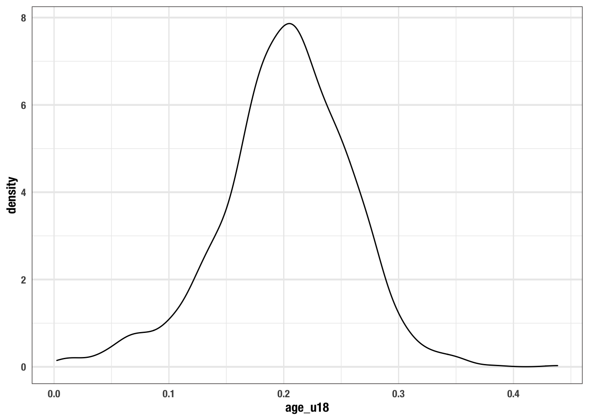
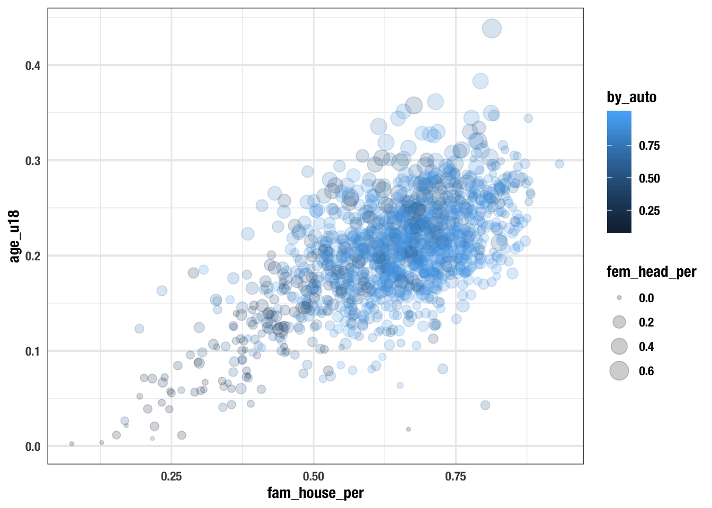

# Visualizing Trends and Relationships


```r
library(tidyverse)
## ── Attaching packages ──────────────────────────────────── tidyverse 1.2.1 ──
## ✓ tibble  2.1.3     ✓ purrr   0.3.3
## ✓ tidyr   1.0.2     ✓ dplyr   0.8.3
## ✓ readr   1.3.1     ✓ stringr 1.4.0
## ✓ tibble  2.1.3     ✓ forcats 0.4.0
## ── Conflicts ─────────────────────────────────────── tidyverse_conflicts() ──
## x dplyr::filter() masks stats::filter()
## x dplyr::lag()    masks stats::lag()

acs_messy <- read_csv("data/ACS_1317_TRACT.csv")
## Parsed with column specification:
## cols(
##   .default = col_double(),
##   name = col_character(),
##   med_yr_built = col_character(),
##   town = col_character(),
##   county = col_character(),
##   m_atown = col_character()
## )
## See spec(...) for full column specifications.

acs <- acs_messy %>% 
  separate(name, sep = ", ", into = c("tract", "county", "state")) %>% 
  mutate(tract = str_remove(tract, "Census Tract ")) %>% 
  na.omit()
```


- most data analyses start with a visualization. 
- the data we have will dictate the type of visualizations we create
- there are many many different ways in which data can be represented
- generally these can be bucketed into a few major categories
  - numeric 
    - integer
    - double
  - character 
    - think groups, factors, nominal, anything that doesn't have a numeric value that makes sense to count, aggregate, etc.
  - time / order 
  
## Univariate visualizations

- what are we looking for in univariate visualizations?
- the shape of the distribution
- measures of central tendency
  - where do the data cluster?
  - is there a center? more than one?
- how much variation is in the data?
  - is the distribution flatter or steeper?

### histogram

- puts data into `n` groups or bins or buckets. ggplot calls them `bins`
- you can identify how many obs fit into a bucket
  

```r
ggplot(acs, aes(age_u18)) +
  geom_histogram(bins = 15)
```



### density plot

- A density plot is a representation of the distribution of a numeric variable
- visualizes the distribution of data over a continuous interval
- it's called a density plot because it uses a kernel density.
  - you do not need to know what this is, just that it shows a continuous representation of the distribution
- unlike histograms you cannot determine how many obs fall in a bucket as there are no buckets.


```r
ggplot(acs, aes(age_u18)) +
  geom_density()
```



### box plot


- box plots are another way to show the distribution
- unlike histograms and density plots which show the shape of the distribution box plots are concerned with illustrating any potential outliers
  - aside: an outlier is a value that differs substantially from other obs
- based on 5 summary values:
  - the first quartile 
  - median (the middle value)
  - the third quartile
  - the _minimum_ and the _maximum_:
    - these aren't actually the max and min, these are 
- we have to set this aesthetic to `y`
  
refs:

- https://towardsdatascience.com/understanding-boxplots-5e2df7bcbd51


```r
ggplot(acs, aes(y = age_u18)) +
  geom_boxplot() 
```



- its easier to evaluate a box plot when it's horizontal.
  - we can flip any ggplot with a `coord_flip()` layer


  

```r
ggplot(acs, aes(y = age_u18)) +
  geom_boxplot() +
  coord_flip()
```



#### understanding the box plot

## Bivariate visualizations

with bi-variate relationships we're looking to answer, in general, if one variable affects the other. we usually will be comparing two numeric variables or one numeric and one categorical variable
in the former situtation we're looking to see if there is a related trend, i.e. when one goes up does the other go down or vice versa
in the latter scenario, we want to know if the distribution of the data changes for different groups

### scatter plot (2 continuous)
  - we made one previously
  - this is two continuous on each axis.
  - the variable of interest is on the y
  - example:
    - we can hypothesize that where there are more under 18 there are more families
    - we can ask how does the prop of population under 18 vary with prop of family households?
    - when there are many points (which is often the case w/ big data) we can change the transparency (often called opacity) so we can see where there is the most overlap. Inside of the `geom_point()` we set the `alpha` argument to a value between 0 and 1 where 1 is not transparent and 0 is invisible.
    - this is artistic preference and there is no one true answer
    


```r
ggplot(acs, aes(fam_house_per, age_u18)) +
  geom_point(alpha = 0.25)
```



### boxplot (1 continuous 1 categorical)

  - we can use boxplots to compare groups
  - for this, we set the categorical variable to the x aesthetic
  

```r
ggplot(acs, aes(county, age_u18)) +
  geom_boxplot() +
  coord_flip()
```


### barplot (1 categorical 1 continuous / discrete)

- the `geom_bar()` will count the number observations of the specified categorical variables


```r
ggplot(acs, aes(county)) +
  geom_bar() +
  coord_flip()
```


### lollipop chart

- barplot's more fun cousin, the lollipop chart
- the package `ggalt` makes a `geom` for us so we don't have to create it manually
- we do, however, have to count the observations ourself. 
  - we use the function `count()` to do this. 
  - the arguments are `x`, or the tibble, and `...` these are the columns we want to count
    - important note: in the tidyverse, the first argument is almost always the tibble we are working with
    - this will become very useful at a later point
- remember, to install packages, navigate to the console and use the function `install.packages("pkg-name")`.


```r
library(ggalt)
## Registered S3 methods overwritten by 'ggalt':
##   method                  from   
##   grid.draw.absoluteGrob  ggplot2
##   grobHeight.absoluteGrob ggplot2
##   grobWidth.absoluteGrob  ggplot2
##   grobX.absoluteGrob      ggplot2
##   grobY.absoluteGrob      ggplot2

acs_counties <- count(acs, county)

ggplot(acs_counties, aes(county, n)) +
  geom_lollipop() +
  coord_flip()
```




- ridgelines (1 continuous 1 categorical)
- line chart (1 continuous 1 time), this is a unique case

## Expanding bivariate visualizations to trivariate & other tri-variate

- we can visualize other vcariables by setting further aesthetics.
  - can set the color or fill, size, and shape
- we alreay did this previously when we set the color, let's do that here. 
  - lets see how commuting by walking changes with the family house and under 18 pop
    - set the color argument of the `aes()` function as `color = by_walk`
      - it's important you do this within the aesthetics function 
    

```r
ggplot(acs, aes(fam_house_per, age_u18, color = by_auto)) +
  geom_point()
```



- we can add size to this as well by setting the `size` aesthetic
  - lets see if the more female headed house holds there are affects commuting by car as minors increases


```r
ggplot(acs, aes(fam_house_per, age_u18, color = by_auto, size = fem_head_per)) +
  geom_point(alpha = .2)
```



- from this chart we can see quite a few things:
  - as `fam_house_per` increases so does the under 18 pop,
  - as both `age_u18` and `fam_house_per` increase so does the rate of communiting by car
  - as both `age_u18` and `fam_house_per` so does female headed houses, but to a lesser degree
  - this gives us a good idea of some relationships that we can test with our data at a later point


```r
minors_lm <- lm(age_u18 ~ fam_house_per + by_auto + fem_head_per, data = acs)

huxtable::huxreg(minors_lm)
## Registered S3 methods overwritten by 'broom.mixed':
##   method         from 
##   augment.lme    broom
##   augment.merMod broom
##   glance.lme     broom
##   glance.merMod  broom
##   glance.stanreg broom
##   tidy.brmsfit   broom
##   tidy.gamlss    broom
##   tidy.lme       broom
##   tidy.merMod    broom
##   tidy.rjags     broom
##   tidy.stanfit   broom
##   tidy.stanreg   broom
```

<!--html_preserve--><table class="huxtable" style="border-collapse: collapse; margin-bottom: 2em; margin-top: 2em; width: 50%; margin-left: auto; margin-right: auto;  ">
<col><col><tr>
<td style="vertical-align: top; text-align: center; white-space: nowrap; border-style: solid solid solid solid; border-width: 0.8pt 0pt 0pt 0pt; padding: 4pt 4pt 4pt 4pt;"></td>
<td style="vertical-align: top; text-align: center; white-space: nowrap; border-style: solid solid solid solid; border-width: 0.8pt 0pt 0.4pt 0pt; padding: 4pt 4pt 4pt 4pt;">(1)</td>
</tr>
<tr>
<td style="vertical-align: top; text-align: left; white-space: nowrap; padding: 4pt 4pt 4pt 4pt;">(Intercept)</td>
<td style="vertical-align: top; text-align: right; white-space: nowrap; padding: 4pt 4pt 4pt 4pt;">0.000&nbsp;&nbsp;&nbsp;&nbsp;</td>
</tr>
<tr>
<td style="vertical-align: top; text-align: left; white-space: nowrap; padding: 4pt 4pt 4pt 4pt;"></td>
<td style="vertical-align: top; text-align: right; white-space: nowrap; padding: 4pt 4pt 4pt 4pt;">(0.006)&nbsp;&nbsp;&nbsp;</td>
</tr>
<tr>
<td style="vertical-align: top; text-align: left; white-space: nowrap; padding: 4pt 4pt 4pt 4pt;">fam_house_per</td>
<td style="vertical-align: top; text-align: right; white-space: nowrap; padding: 4pt 4pt 4pt 4pt;">0.245 ***</td>
</tr>
<tr>
<td style="vertical-align: top; text-align: left; white-space: nowrap; padding: 4pt 4pt 4pt 4pt;"></td>
<td style="vertical-align: top; text-align: right; white-space: nowrap; padding: 4pt 4pt 4pt 4pt;">(0.009)&nbsp;&nbsp;&nbsp;</td>
</tr>
<tr>
<td style="vertical-align: top; text-align: left; white-space: nowrap; padding: 4pt 4pt 4pt 4pt;">by_auto</td>
<td style="vertical-align: top; text-align: right; white-space: nowrap; padding: 4pt 4pt 4pt 4pt;">0.016 *&nbsp;&nbsp;</td>
</tr>
<tr>
<td style="vertical-align: top; text-align: left; white-space: nowrap; padding: 4pt 4pt 4pt 4pt;"></td>
<td style="vertical-align: top; text-align: right; white-space: nowrap; padding: 4pt 4pt 4pt 4pt;">(0.007)&nbsp;&nbsp;&nbsp;</td>
</tr>
<tr>
<td style="vertical-align: top; text-align: left; white-space: nowrap; padding: 4pt 4pt 4pt 4pt;">fem_head_per</td>
<td style="vertical-align: top; text-align: right; white-space: nowrap; padding: 4pt 4pt 4pt 4pt;">0.257 ***</td>
</tr>
<tr>
<td style="vertical-align: top; text-align: left; white-space: nowrap; padding: 4pt 4pt 4pt 4pt;"></td>
<td style="vertical-align: top; text-align: right; white-space: nowrap; border-style: solid solid solid solid; border-width: 0pt 0pt 0.4pt 0pt; padding: 4pt 4pt 4pt 4pt;">(0.012)&nbsp;&nbsp;&nbsp;</td>
</tr>
<tr>
<td style="vertical-align: top; text-align: left; white-space: nowrap; padding: 4pt 4pt 4pt 4pt;">N</td>
<td style="vertical-align: top; text-align: right; white-space: nowrap; padding: 4pt 4pt 4pt 4pt;">1311&nbsp;&nbsp;&nbsp;&nbsp;&nbsp;&nbsp;&nbsp;&nbsp;</td>
</tr>
<tr>
<td style="vertical-align: top; text-align: left; white-space: nowrap; padding: 4pt 4pt 4pt 4pt;">R2</td>
<td style="vertical-align: top; text-align: right; white-space: nowrap; padding: 4pt 4pt 4pt 4pt;">0.564&nbsp;&nbsp;&nbsp;&nbsp;</td>
</tr>
<tr>
<td style="vertical-align: top; text-align: left; white-space: nowrap; padding: 4pt 4pt 4pt 4pt;">logLik</td>
<td style="vertical-align: top; text-align: right; white-space: nowrap; padding: 4pt 4pt 4pt 4pt;">2444.648&nbsp;&nbsp;&nbsp;&nbsp;</td>
</tr>
<tr>
<td style="vertical-align: top; text-align: left; white-space: nowrap; border-style: solid solid solid solid; border-width: 0pt 0pt 0.8pt 0pt; padding: 4pt 4pt 4pt 4pt;">AIC</td>
<td style="vertical-align: top; text-align: right; white-space: nowrap; border-style: solid solid solid solid; border-width: 0pt 0pt 0.8pt 0pt; padding: 4pt 4pt 4pt 4pt;">-4879.296&nbsp;&nbsp;&nbsp;&nbsp;</td>
</tr>
<tr>
<td colspan="2" style="vertical-align: top; text-align: left; white-space: normal; padding: 4pt 4pt 4pt 4pt;"> *** p &lt; 0.001;  ** p &lt; 0.01;  * p &lt; 0.05.</td>
</tr>
</table>
<!--/html_preserve-->


Trivariate:

- grouped / stacked bar charts
- heatmaps 

## The Grammar of Layered Graphics

recommended reading: [A Layered Grammar of Graphics](https://vita.had.co.nz/papers/layered-grammar.pdf)

- in R we will use a package called ggplot2 to do the visualizaiton of our data 
- the `gg` in ggplot stands for "grammar of graphics".
- once we can internalize the grammar, creating plots becomes rather easy
- we specify our aesthetics
- we **add** layers (hence the plus sign). these take values from the specified aesthetics
- can add multiple layers
- add aesthetics other than x and y. helps us visualize more dimensions of the data. we can use shape, color, and size


### revisiting the cartesian plane

- x and y coordinates
- generally two numeric values on the x and y. think of the standards scatterplot (below)
- we also can place groups on one axis
  - i.e. barchart (below)
- the y is usually the variable of interest
  - as we move along the x axis (to the right) we can see how the y changes in response
  

