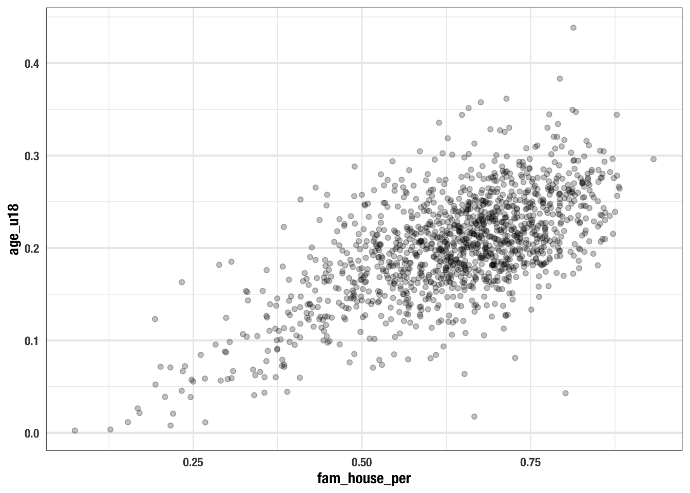
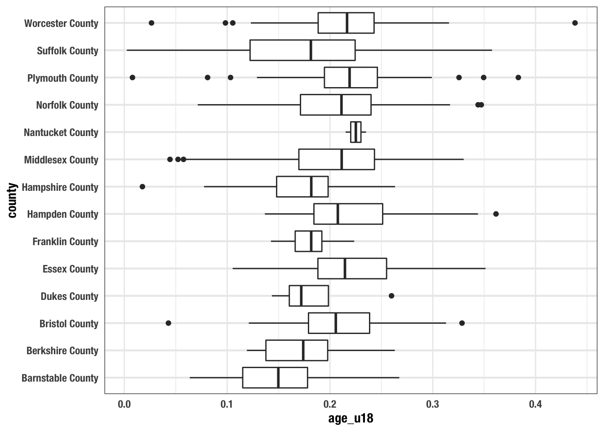
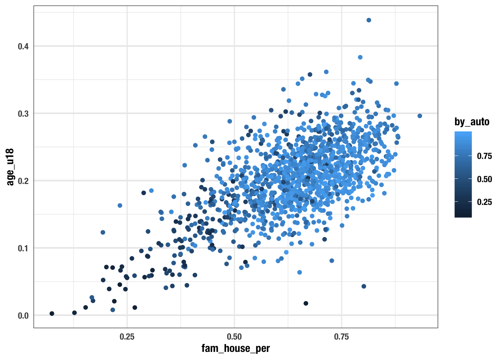

# Visualizing Trends and Relationships


```r
library(tidyverse)

acs_messy <- read_csv("data/ACS_1317_TRACT.csv")

acs <- acs_messy %>% 
  separate(name, sep = ", ", into = c("tract", "county", "state")) %>% 
  mutate(tract = str_remove(tract, "Census Tract ")) %>% 
  na.omit()
```

You've made it quite far through this book. Now, I want to bring us back to the very beginning. In the first chapter we created a few visualizations with `ggplot2`. I want to unpack ggplot2 a bit more and also address some of the more philosophical underpinnings of visualization.

This chapter introduces you to the idea of the grammar of graphics, discusses when which visualizations are appropriate, and some fundamental design principles follow. 


## The Grammar of Layered Graphics

The `gg` in `ggplot2` refers to the grammar of graphics (and the `2` is because it's the second iteration). _The Grammar of Graphics_ (Wilkinson, 1999) is a seminal book in data visualization for the sciences in which, Wilkinson defines a complete system (grammar) for creating visualizations that go beyond the standard domain of "named graphics"—e.g. histogram, barchart, etc. [^wickham] 

ggplot2 is "an open source implementation of the grammar of graphics for **R**."[^wickham] Once we can internalize the grammar of graphics, creating plots will be an intuitive and artistic process rather than a mechanical one.

There are five high level components of the layered grammar[^wickham].

1. Defaults:
    - Data
    - Mapping
2. Layer:
    - Data*
    - Mapping* 
    - Geom
    - Stat
    - Position 
3. Scale
4. Coord
5. Facet

## Layers and defaults

In the first chapter of this section we explored these principles but did not put a name to them. Recall that we can use `ggplot()` by itself and it returns a chart of nothing.


```r
ggplot()
```


This is because we have not specified any of the defaults. In order for us to plot anything at all, we need to specify what (the data object) will be visualized, which features (the aesthetic mappings), and how (the geoms). When we begin to specify our x and y aesthetics the scales are interpreted.


```r
ggplot(acs, aes(med_house_income, by_auto))
```


The final step is to add the geom layer which will inherit the data, aesthetic mappings, scale, and position while the `geom_*()` layer dictates the geometry.


```r
ggplot(acs, aes(bach, med_house_income))+ 
  geom_point()
```


While this is the most common way you might define a ggplot, you should also be aware of the fact that each layer can stand on its own without you defining any of the defaults in the `ggplot()` call. Each geom inherits the defaults from `ggplot()`, but each `geom_*()` also has arguments for `data`, and `mapping`, providing you with increased flexibility.

> Note: the `geom_*()`s have the data as the second argument so either put the data there or name the argument explicitly. The choice is yours. Choose wisely! 

What happens if we provide all of this information to `geom_point()` and entirely omit `ggplot()`?


```r
geom_point(aes(med_house_income, by_auto), acs)
## mapping: x = ~med_house_income, y = ~by_auto 
## geom_point: na.rm = FALSE
## stat_identity: na.rm = FALSE
## position_identity
```

We see that we do not have the plot, but we do have all of the information required of a layer is printed out to the console. If we add an empty ggplot call ahead of the layer, we will be able to create the plot.


```r
ggplot() + 
  geom_point(aes(med_house_income, by_auto), acs)
```


Being able to specify different data objects within each layer will provie to be extraordinarily helpful when we begin to work with spatial data, or plotting two different data frames with the same axes, or any other creative problem you wish to solve. 


## Scales 


## Coordinates

## Facets


  
  
-------------

We now have a language for creating graphics. Next we must build the intuition of which plots to build and when. We will cover the most basic of visualizations starting with univariate followed by bivariate plots. We will then discuss ways to extend visualizations beyond two variables and some simple principles of design.

In most cases a data analysis will start with a visualization. And that visualization will be dictated by the characteristics of the data available to us. In intro to statistics you probably learned about the four types of data which are: nominal and ordinal, together referred to as _categorical_;  interval and ratio, together referred to as _numerical_ We're going to contextualize these in R terms where _categorical_ is `character` and _numerical_ is `numeric`.

Categorical and numeric have different are treated differently and thus lead to different kinds of visualizations. When we refer to categorical or character, we are often thinking of groups or a label. In the case where we don't have a quantifiable numeric value, we often count those variables.

  
## Univariate visualizations

There is always a strong urge to begin creating epic graphs with facets, shapes, colors, and hell, maybe even three dimensions. But we must resist that urge! We _must_ understand the distributions of our data before we start visualizing them and drawing conlcusions. Who knows, we may find anomalies or errors in the data cleaning process or even collection process. We should always begin by studying the indivual variable characteristics with univariate visualizations. 


> Note that univariate visualizations are for numeric variables

There a couple of things that we are looking for in a univariate visualization. In the broadest sense, we're looking at characterizations of central tendency, and spread. When we create these visualizations we're trying to answer the following questions:


- Where is the middle? 
- Is there more than one middle? 
- How close together are our points? 
- Are there any points very far from the middle?
- Is the distribution flat? Is it steep?

In exploring these questions we will rely on three types of plots:

1. Histogram
2. Density 
3. Box plot

Each type of plot above serves a different purpose.  

### Histogram

We have already created a number of histograms already. But it is always good to revisit the subject. Histograms puts our data into `n` buckets (or bins, or groups, or whatever your stats professor called them), counts the number of values that fall into each bucket, and use that frequency count as the height of each bar. 

The true benefit of the histogram is that it is the easiest chart to consume by the layperson. But the downside is that merely by changing the number of bins, the distribution can be rather distorted and it is on you, the researcher and analyst, to ensure that there is no miscommunication of data.

When we wish to create a histogram, we use the `geom_histogram(bins = n)` geom layer. Since it is a univariate visualization, we only specify one aesthetic mapping—in this case it is `x`. 

Let's look at the distribution of the `med_yr_moved_inraw` column for an example.


* Create a histogram of `med_yr_moved_inraw` with 10 bins. 


```r
ggplot(acs, aes(med_yr_moved_inraw)) +
  geom_histogram(bins = 10)
```


This histogram is rather informative! We can see that shortly after 2000, there was a steep increase in people moving in. Right after 2005 we can see that number tapering off—presumably due to the housing crises that begat the Great Recession.

Now, if we do not specify the number of bins, we get a very different histogram. 


```r
ggplot(acs, aes(med_yr_moved_inraw)) +
  geom_histogram()
```


The above histogram shows gaps in between buckets of the histogram. On a first glance, we would assume that there may be missing data or some phenemonon in the data recording process that led to some sort of missingness. But that isn't the case! If we count the number of observations per year manually, the story becomes apparent.

> Note: I am using the base R function `table()` to produce counts. This produces a class `table` object which is less friendly to work with. Using `table()` rather than count serves two purposes: 1) you get to learn another function and 2) the printing method is more friendly for a bookdown document. 


```r
(moved_counts <- table(acs$med_yr_moved_inraw))
## 
## 1991 1995 1996 1997 1998 1999 2000 2001 2002 2003 2004 2005 2006 2007 2008 
##    1    2    5    7   14   31   56   77  108  121  141  109  113   84   73 
## 2009 2010 2011 2012 2013 
##   67  125  140   29    8

glue::glue("There are {length(moved_counts)} unique values")
## There are 20 unique values
```

> The glue function provides a way to create strings by combining R expressions and plain text. More in the appendix.

This above tells us something really important and explains why our histogram is all wonky. Our histogram looks the way it does because we have specified more bins than there are unique values! Moral of the story, when creating a histogram be thoughtful and considerate of the number of bins your are using—it changes the whole story.


### density plot

- A density plot is a representation of the distribution of a numeric variable
- visualizes the distribution of data over a continuous interval
- it's called a density plot because it uses a kernel density.
  - you do not need to know what this is, just that it shows a continuous representation of the distribution
- unlike histograms you cannot determine how many obs fall in a bucket as there are no buckets.


```r
ggplot(acs, aes(age_u18)) +
  geom_density()
```


### box plot


- box plots are another way to show the distribution
- unlike histograms and density plots which show the shape of the distribution box plots are concerned with illustrating any potential outliers
  - aside: an outlier is a value that differs substantially from other obs
- based on 5 summary values:
  - the first quartile 
  - median (the middle value)
  - the third quartile
  - the _minimum_ and the _maximum_:
    - these aren't actually the max and min, these are 
- we have to set this aesthetic to `y`
  
refs:

- https://towardsdatascience.com/understanding-boxplots-5e2df7bcbd51


```r
ggplot(acs, aes(y = age_u18)) +
  geom_boxplot() 
```


- its easier to evaluate a box plot when it's horizontal.
  - we can flip any ggplot with a `coord_flip()` layer


  

```r
ggplot(acs, aes(y = age_u18)) +
  geom_boxplot() +
  coord_flip()
```


#### understanding the box plot

## Bivariate visualizations

with bi-variate relationships we're looking to answer, in general, if one variable affects the other. we usually will be comparing two numeric variables or one numeric and one categorical variable
in the former situtation we're looking to see if there is a related trend, i.e. when one goes up does the other go down or vice versa
in the latter scenario, we want to know if the distribution of the data changes for different groups

### scatter plot (2 continuous)
  - we made one previously
  - this is two continuous on each axis.
  - the variable of interest is on the y
  - example:
    - we can hypothesize that where there are more under 18 there are more families
    - we can ask how does the prop of population under 18 vary with prop of family households?
    - when there are many points (which is often the case w/ big data) we can change the transparency (often called opacity) so we can see where there is the most overlap. Inside of the `geom_point()` we set the `alpha` argument to a value between 0 and 1 where 1 is not transparent and 0 is invisible.
    - this is artistic preference and there is no one true answer
    


```r
ggplot(acs, aes(fam_house_per, age_u18)) +
  geom_point(alpha = 0.25)
```



### boxplot (1 continuous 1 categorical)

  - we can use boxplots to compare groups
  - for this, we set the categorical variable to the x aesthetic
  

```r
ggplot(acs, aes(county, age_u18)) +
  geom_boxplot() +
  coord_flip()
```




### barplot (1 categorical 1 continuous / discrete)

- the `geom_bar()` will count the number observations of the specified categorical variables


```r
ggplot(acs, aes(county)) +
  geom_bar() +
  coord_flip()
```



### lollipop chart

- barplot's more fun cousin, the lollipop chart
- the package `ggalt` makes a `geom` for us so we don't have to create it manually
- we do, however, have to count the observations ourself. 
  - we use the function `count()` to do this. 
  - the arguments are `x`, or the tibble, and `...` these are the columns we want to count
    - important note: in the tidyverse, the first argument is almost always the tibble we are working with
    - this will become very useful at a later point
- remember, to install packages, navigate to the console and use the function `install.packages("pkg-name")`.


```r
library(ggalt)
## Registered S3 methods overwritten by 'ggalt':
##   method                  from   
##   grid.draw.absoluteGrob  ggplot2
##   grobHeight.absoluteGrob ggplot2
##   grobWidth.absoluteGrob  ggplot2
##   grobX.absoluteGrob      ggplot2
##   grobY.absoluteGrob      ggplot2

acs_counties <- count(acs, county)

ggplot(acs_counties, aes(county, n)) +
  geom_lollipop() +
  coord_flip()
```


- ridgelines (1 continuous 1 categorical)
- line chart (1 continuous 1 time), this is a unique case

## Expanding bivariate visualizations to trivariate & other tri-variate

- we can visualize other vcariables by setting further aesthetics.
  - can set the color or fill, size, and shape
- we alreay did this previously when we set the color, let's do that here. 
  - lets see how commuting by walking changes with the family house and under 18 pop
    - set the color argument of the `aes()` function as `color = by_walk`
      - it's important you do this within the aesthetics function 
    

```r
ggplot(acs, aes(fam_house_per, age_u18, color = by_auto)) +
  geom_point()
```


- we can add size to this as well by setting the `size` aesthetic
  - lets see if the more female headed house holds there are affects commuting by car as minors increases


```r
ggplot(acs, aes(fam_house_per, age_u18, color = by_auto, size = fem_head_per)) +
  geom_point(alpha = .2)
```


- from this chart we can see quite a few things:
  - as `fam_house_per` increases so does the under 18 pop,
  - as both `age_u18` and `fam_house_per` increase so does the rate of communiting by car
  - as both `age_u18` and `fam_house_per` so does female headed houses, but to a lesser degree
  - this gives us a good idea of some relationships that we can test with our data at a later point


```r
minors_lm <- lm(age_u18 ~ fam_house_per + by_auto + fem_head_per, data = acs)

huxtable::huxreg(minors_lm)
## Registered S3 methods overwritten by 'broom.mixed':
##   method         from 
##   augment.lme    broom
##   augment.merMod broom
##   glance.lme     broom
##   glance.merMod  broom
##   glance.stanreg broom
##   tidy.brmsfit   broom
##   tidy.gamlss    broom
##   tidy.lme       broom
##   tidy.merMod    broom
##   tidy.rjags     broom
##   tidy.stanfit   broom
##   tidy.stanreg   broom
```

<!--html_preserve--><table class="huxtable" style="border-collapse: collapse; margin-bottom: 2em; margin-top: 2em; width: 50%; margin-left: auto; margin-right: auto;  ">
<col><col><tr>
<td style="vertical-align: top; text-align: center; white-space: nowrap; border-style: solid solid solid solid; border-width: 0.8pt 0pt 0pt 0pt; padding: 4pt 4pt 4pt 4pt;"></td>
<td style="vertical-align: top; text-align: center; white-space: nowrap; border-style: solid solid solid solid; border-width: 0.8pt 0pt 0.4pt 0pt; padding: 4pt 4pt 4pt 4pt;">(1)</td>
</tr>
<tr>
<td style="vertical-align: top; text-align: left; white-space: nowrap; padding: 4pt 4pt 4pt 4pt;">(Intercept)</td>
<td style="vertical-align: top; text-align: right; white-space: nowrap; padding: 4pt 4pt 4pt 4pt;">0.000&nbsp;&nbsp;&nbsp;&nbsp;</td>
</tr>
<tr>
<td style="vertical-align: top; text-align: left; white-space: nowrap; padding: 4pt 4pt 4pt 4pt;"></td>
<td style="vertical-align: top; text-align: right; white-space: nowrap; padding: 4pt 4pt 4pt 4pt;">(0.006)&nbsp;&nbsp;&nbsp;</td>
</tr>
<tr>
<td style="vertical-align: top; text-align: left; white-space: nowrap; padding: 4pt 4pt 4pt 4pt;">fam_house_per</td>
<td style="vertical-align: top; text-align: right; white-space: nowrap; padding: 4pt 4pt 4pt 4pt;">0.245 ***</td>
</tr>
<tr>
<td style="vertical-align: top; text-align: left; white-space: nowrap; padding: 4pt 4pt 4pt 4pt;"></td>
<td style="vertical-align: top; text-align: right; white-space: nowrap; padding: 4pt 4pt 4pt 4pt;">(0.009)&nbsp;&nbsp;&nbsp;</td>
</tr>
<tr>
<td style="vertical-align: top; text-align: left; white-space: nowrap; padding: 4pt 4pt 4pt 4pt;">by_auto</td>
<td style="vertical-align: top; text-align: right; white-space: nowrap; padding: 4pt 4pt 4pt 4pt;">0.016 *&nbsp;&nbsp;</td>
</tr>
<tr>
<td style="vertical-align: top; text-align: left; white-space: nowrap; padding: 4pt 4pt 4pt 4pt;"></td>
<td style="vertical-align: top; text-align: right; white-space: nowrap; padding: 4pt 4pt 4pt 4pt;">(0.007)&nbsp;&nbsp;&nbsp;</td>
</tr>
<tr>
<td style="vertical-align: top; text-align: left; white-space: nowrap; padding: 4pt 4pt 4pt 4pt;">fem_head_per</td>
<td style="vertical-align: top; text-align: right; white-space: nowrap; padding: 4pt 4pt 4pt 4pt;">0.257 ***</td>
</tr>
<tr>
<td style="vertical-align: top; text-align: left; white-space: nowrap; padding: 4pt 4pt 4pt 4pt;"></td>
<td style="vertical-align: top; text-align: right; white-space: nowrap; border-style: solid solid solid solid; border-width: 0pt 0pt 0.4pt 0pt; padding: 4pt 4pt 4pt 4pt;">(0.012)&nbsp;&nbsp;&nbsp;</td>
</tr>
<tr>
<td style="vertical-align: top; text-align: left; white-space: nowrap; padding: 4pt 4pt 4pt 4pt;">N</td>
<td style="vertical-align: top; text-align: right; white-space: nowrap; padding: 4pt 4pt 4pt 4pt;">1311&nbsp;&nbsp;&nbsp;&nbsp;&nbsp;&nbsp;&nbsp;&nbsp;</td>
</tr>
<tr>
<td style="vertical-align: top; text-align: left; white-space: nowrap; padding: 4pt 4pt 4pt 4pt;">R2</td>
<td style="vertical-align: top; text-align: right; white-space: nowrap; padding: 4pt 4pt 4pt 4pt;">0.564&nbsp;&nbsp;&nbsp;&nbsp;</td>
</tr>
<tr>
<td style="vertical-align: top; text-align: left; white-space: nowrap; padding: 4pt 4pt 4pt 4pt;">logLik</td>
<td style="vertical-align: top; text-align: right; white-space: nowrap; padding: 4pt 4pt 4pt 4pt;">2444.648&nbsp;&nbsp;&nbsp;&nbsp;</td>
</tr>
<tr>
<td style="vertical-align: top; text-align: left; white-space: nowrap; border-style: solid solid solid solid; border-width: 0pt 0pt 0.8pt 0pt; padding: 4pt 4pt 4pt 4pt;">AIC</td>
<td style="vertical-align: top; text-align: right; white-space: nowrap; border-style: solid solid solid solid; border-width: 0pt 0pt 0.8pt 0pt; padding: 4pt 4pt 4pt 4pt;">-4879.296&nbsp;&nbsp;&nbsp;&nbsp;</td>
</tr>
<tr>
<td colspan="2" style="vertical-align: top; text-align: left; white-space: normal; padding: 4pt 4pt 4pt 4pt;"> *** p &lt; 0.001;  ** p &lt; 0.01;  * p &lt; 0.05.</td>
</tr>
</table>
<!--/html_preserve-->


Trivariate:

- grouped / stacked bar charts
- heatmaps 


Color Ramps:

- diverging when there is a true middle
- dark is low bright is high


- most data analyses start with a visualization. 
- the data we have will dictate the type of visualizations we create
- there are many many different ways in which data can be represented
- generally these can be bucketed into a few major categories
  - numeric 
    - integer
    - double
  - character 
    - think groups, factors, nominal, anything that doesn't have a numeric value that makes sense to count, aggregate, etc.
  - time / order 
  
  
twitter thread on this:

<blockquote class="twitter-tweet"><p lang="en" dir="ltr"><a href="https://twitter.com/hashtag/rstats?src=hash&amp;ref_src=twsrc%5Etfw">#rstats</a> / general <a href="https://twitter.com/hashtag/datascience?src=hash&amp;ref_src=twsrc%5Etfw">#datascience</a> tweeps:<br><br>what types of visualizations do you think new folks should learn and embrace? i.e. hists, scatters, etc.</p>&mdash; Josiah 👨🏻
💻 (@JosiahParry) <a href="https://twitter.com/JosiahParry/status/1216059573548638208?ref_src=twsrc%5Etfw">January 11, 2020</a></blockquote> <script async src="https://platform.twitter.com/widgets.js" charset="utf-8"></script>


-----------

**Notes**

- we specify data and mappings, nothing is displayed at that time
- from the defaults we can see that the scales and coordinates are intuitively handled
- the default coordinate system is the cartesian coordinate system which has two axes x (horizontal), and y (vertical)
- in order to see the data, we needed to add geometry to our base layer
  - when we add Geoms to the graphic the data and aesthetic mappings are inherited from the defaults
- we do not necessarily need to default data if we do not feel the need to do so. 
- we can specify the data and mappings inside of the geom layer itself
  - this will be handy when we work with geospatial data
- stat refers to statistical transformations. 
  - often you will not need to apply transformations to your data as their _identity_ (assigned values) are sufficient.


[^wickham]: https://vita.had.co.nz/papers/layered-grammar.pdf
https://cfss.uchicago.edu/notes/grammar-of-graphics/

recommended reading: [A Layered Grammar of Graphics](https://vita.had.co.nz/papers/layered-grammar.pdf)

- in R we will use a package called ggplot2 to do the visualizaiton of our data 
- the `gg` in ggplot stands for "grammar of graphics".
- once we can internalize the grammar, creating plots becomes rather easy
- we specify our aesthetics
- we **add** layers (hence the plus sign). these take values from the specified aesthetics
- can add multiple layers
- add aesthetics other than x and y. helps us visualize more dimensions of the data. we can use shape, color, and size


### revisiting the cartesian plane

- x and y coordinates
- generally two numeric values on the x and y. think of the standards scatterplot (below)
- we also can place groups on one axis
  - i.e. barchart (below)
- the y is usually the variable of interest
  - as we move along the x axis (to the right) we can see how the y changes in response
