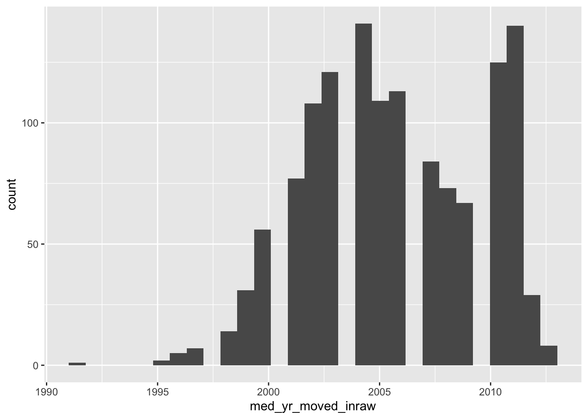
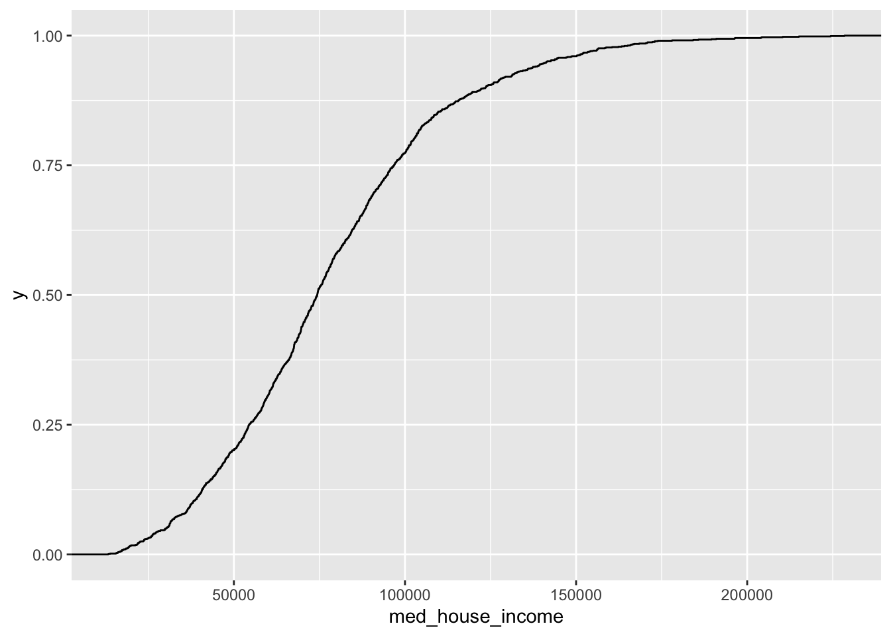
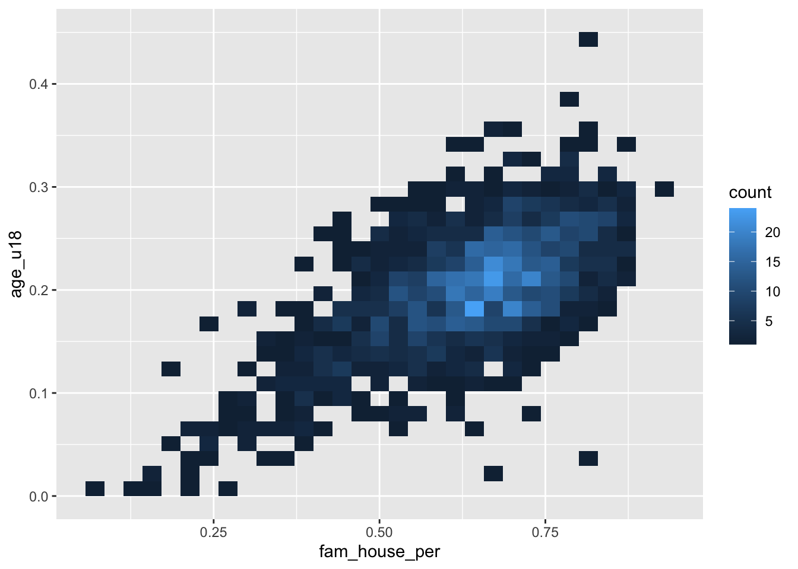
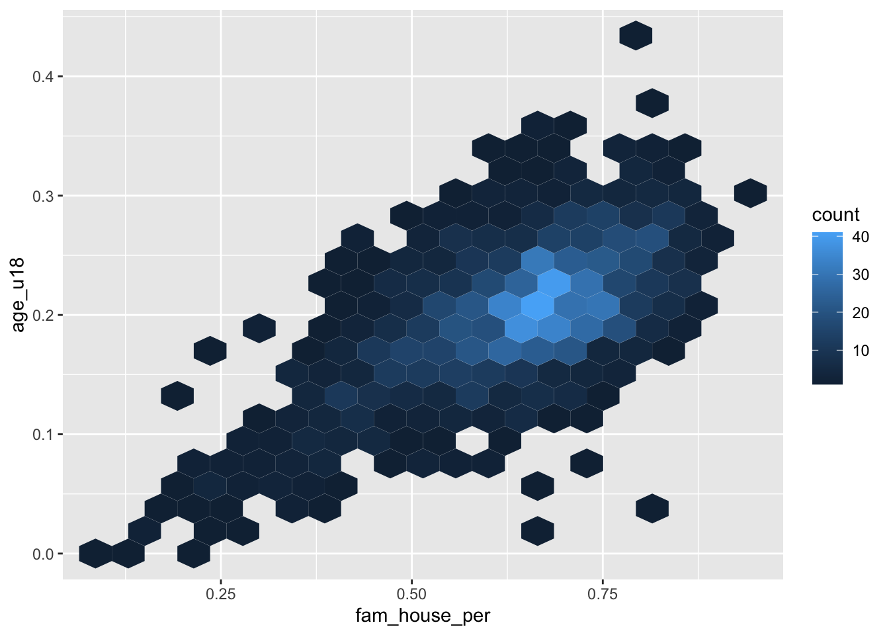
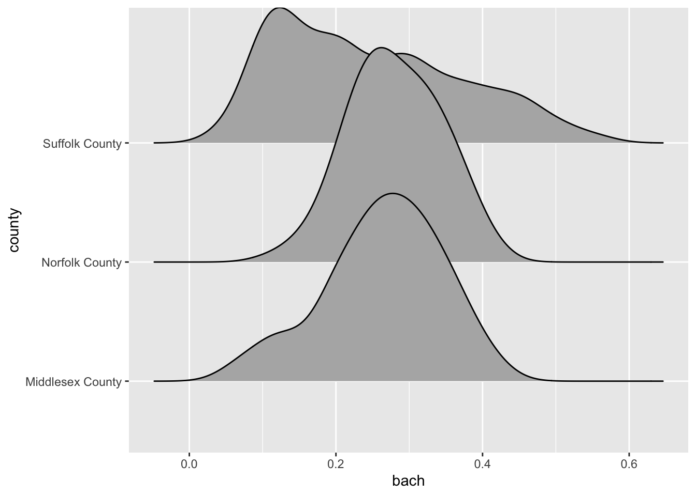

# Visualizing Trends and Relationships


We now have a language for creating graphics. Next we must build the intuition of which plots to build and when. We will cover the most basic of visualizations starting with univariate followed by bivariate plots. We will then discuss ways to extend visualizations beyond two variables and some simple principles of design.

In most cases a data analysis will start with a visualization. And that visualization will be dictated by the characteristics of the data available to us. In intro to statistics you probably learned about the four types of data which are: nominal and ordinal, together referred to as _categorical_;  interval and ratio, together referred to as _numerical_ We're going to contextualize these in R terms where _categorical_ is `character` and _numerical_ is `numeric`.

Categorical and numeric have different are treated differently and thus lead to different kinds of visualizations. When we refer to categorical or character, we are often thinking of groups or a label. In the case where we don't have a quantifiable numeric value, we often count those variables.

  
## Univariate visualizations

There is always a strong urge to begin creating epic graphs with facets, shapes, colors, and hell, maybe even three dimensions. But we must resist that urge! We _must_ understand the distributions of our data before we start visualizing them and drawing conlcusions. Who knows, we may find anomalies or errors in the data cleaning process or even collection process. We should always begin by studying the indivual variable characteristics with univariate visualizations. 


> Note that univariate visualizations are for numeric variables

There a couple of things that we are looking for in a numeric univariate visualization. In the broadest sense, we're looking at characterizations of central tendency, and spread. When we create these visualizations we're trying to answer the following questions:


- Where is the middle? 
- Is there more than one middle? 
- How close together are our points? 
- Are there any points very far from the middle?
- Is the distribution flat? Is it steep?

In exploring these questions we will rely on three types of plots:

1. Histogram
2. Density 
3. Box plot

Each type of plot above serves a different purpose.  

### Histogram

We have already created a number of histograms already but it is always good to revisit the subject. Histograms puts our data into `n` buckets (or bins, or groups, or whatever your stats professor called them), counts the number of values that fall into each bucket, and use that frequency count as the height of each bar. 

The true benefit of the histogram is that it is the easiest chart to consume by the layperson. But the downside is that merely by changing the number of bins, the distribution can be rather distorted and it is on you, the researcher and analyst, to ensure that there is no miscommunication of data.

When we wish to create a histogram, we use the `geom_histogram(bins = n)` geom layer. Since it is a univariate visualization, we only specify one aesthetic mapping—in this case it is `x`. 

Let's look at the distribution of the `med_yr_moved_inraw` column for an example.


* Create a histogram of `med_yr_moved_inraw` with 10 bins. 


```r
ggplot(acs, aes(med_yr_moved_inraw)) +
  geom_histogram(bins = 10)
```


This histogram is rather informative! We can see that shortly after 2000, there was a steep increase in people moving in. Right after 2005 we can see that number tapering off—presumably due to the housing crises that begat the Great Recession.

Now, if we do not specify the number of bins, we get a very different histogram. 


```r
ggplot(acs, aes(med_yr_moved_inraw)) +
  geom_histogram()
```


The above histogram shows gaps in between buckets of the histogram. On a first glance, we would assume that there may be missing data or some phenemonon in the data recording process that led to some sort of missingness. But that isn't the case! If we count the number of observations per year manually, the story becomes apparent.

> Note: I am using the base R function `table()` to produce counts. This produces a class `table` object which is less friendly to work with. Using `table()` rather than count serves two purposes: 1) you get to learn another function and 2) the printing method is more friendly for a bookdown document. 


```r
(moved_counts <- table(acs$med_yr_moved_inraw))
## 
## 1991 1995 1996 1997 1998 1999 2000 2001 2002 2003 2004 2005 2006 2007 2008 2009 
##    1    2    5    7   14   31   56   77  108  121  141  109  113   84   73   67 
## 2010 2011 2012 2013 
##  125  140   29    8

glue::glue("There are {length(moved_counts)} unique values")
## There are 20 unique values
```

> The glue function provides a way to create strings by combining R expressions and plain text. More in the appendix.

This above tells us something really important and explains why our histogram is all wonky. Our histogram looks the way it does because we have specified more bins than there are unique values! The moral of the story is that when creating a histogram, be thoughtful and considerate of the number of bins your are using—it changes the whole story.


### Density Function plot


Histograms are a fairly straight-forward chart that provides illustrates the distribution of a sample space. The histogram does not provide a fine grain picture of what the underlying distribution looks like. When we are concerned with understanding the underlying shape of a distribution we should use a **kernel density plot** (aka density plot). 

The density plot represents a variable over a continuous space and by doing so creates a much better visual representation of the underlying distribution shape with all of its curves. 

Like a histogram, we only provide a single variable to the aesthetic mappings. The geom layer for a density distribution is `geom_density()`.

* Create a density plot of `med_yr_moved_inraw`


```r
ggplot(acs, aes(med_yr_moved_inraw)) +
  geom_density()
```




Now compare the histogram to the density plot. 

* Which do you feel does a better job illustrating the shape of the distribution?
* Which do you think is more interpretable?


### Boxplots

The boxplot is the third univariate visualization we will cover. Unlike histograms and density plot, the box plot's power comes from being able to effectively illustrate outliers and the general spread of a variable. 

There are five elements that make the boxplot:

1. Minimum
2. First quartile (25th percentile)
3. Median (50th percentile)
3. Third quartile (75th percentile)
3. Maximum 


When creating a boxplot, the definition of minimum and maximum change a little bit. We are defining the minimums and maximums _without_ the outliers. And in the context of a boxplot the outliers are determined by the **IQR** (inner quartile range). The IQR is different between the third and first quartile. We then take the IQR and _add_ it to the third quartile to find the upper bound and then subtract the IQR from the first quartile to find the lower bound.

$IQR = Q3 - Q1$

$Minimum = Q1 - IQR$

$Maximum = Q3 + IQR$


> Note that this is a naive approach to defining an outlier. This is not a hard and fast rule of what is considered an outlier. There are many considerations that should go into defining an outlier other than arbitrary statistical heuristics. Be sure to have a deep think before calling anything an outlier. 

Any points that fall outside of that the minimum and maximum are plotted individually to give you an idea of any _potential_ outliers. 

To create a boxplot we use the `geom_boxplot()` function.

* Create a boxplot of `med_house_income`


```r
ggplot(acs, aes(med_house_income)) +
  geom_boxplot() 
```


From this boxplot, what can we tell about median household income in Massachusetts? 

### Empirical Cumulative Distribution Function (ECDF)


```r
ggplot(acs, aes(med_house_income)) +
  geom_step(stat = "ecdf")
```


### Barchart

The last univariate chart we will touch on is the bar chart. When we are faced with a single categorical variable there is not much that we can do to summarize it. The approach is to identify the frequency or relative frequency with which each level (unqiue value) occurs. This is essentially a histogram but for values which cannot have ranges and where order does not matter—though we may be interested in ordering our values. 

To create a bar chart of categorical features we simply provide that feature to our aesthetic mapping and add `geom_bar()` layer


```r
ggplot(acs, aes(county)) +
  geom_bar()
```


I'm sure you're looking at this chart and thinking something along the lines of "I can't read a single label, this is awful." And yeah, you're totally right. In general when creating a bar chart it is better to to flip the axes. The main justification for fliping the axes is so that we can read the labels better. In addition to making the labels more legible, by flipping the axes, the comparisons between bars is perceivedly easier.  

To flip the axes, we can map the `county` column to the `y` axis rather than `x` (which is done positionally).


```r
ggplot(acs, aes(y = county)) +
  geom_bar()
```



If you find yourself in the situation where you have variables mapped to both the x and y columns we can add a `coor_flip()` layer to the plot which will handle the flipping for us.


```r
ggplot(acs, aes(county)) +
  geom_bar() +
  coord_flip()
```


Be sure to keep `coord_flip()` in your back pocket! It is a rather handy function. 

## Bivariate visualizations

We are ready to introduce a second variable into the analysis. With bivariate relationships (two-variables) we are often looking to answer, in general, if one variable changes with another. But the way we approach these relationships is dependent upon the type of variables we have to work with. We can can either be looking at the bivariate relationship of 

* 2 numeric variables,
* 1 numeric variable and 1 categorical,
* or 2 categorical variables. 

### Two Numeric Variables

#### Scatter plot

When confronted with two numeric variables, your first stop should be the scatter plot. A scatter plot positions takes two continuous variables and plots each point at their (x, y) coordinate. This type of plot illustrates how the two variables change with each other—if at all. It is exceptionally useful for pinpointing linearity, clusters, points that may be disproportionately distorting a relationship, etc. 

Scatter plots are useful for asking questions such as "when x increases how does y change?" Because of this natural formulation of statistical questions—i.e. we are always interested in how the x affects the y—we plot the variable of interest vertically along the y axis and the independent variable along the horizontal x axis. 

Take for example the question "how does the proportion of individuals under the age of eighteen increase with the number of family households?"

Using a scatter plot, we can begin to answer this question! Notice how in the formulation of our question we are asking how does y change with x. In this formulation we should plot the `fam_house_per` against the `age_u18` column.

> Note: when plotting _against_ something. We are plotting x _against_ y.

Recall that to plot a scatter plot we use the `geom_point()` layer with an x and y aesthetic mapped.


```r
ggplot(acs, aes(fam_house_per, age_u18)) +
  geom_point()
```


The above scatter plot is useful, but there is one downside we should be aware of and that is the number of points that we are plotting. Since there are over 1,400 points—as is often the case with big data—they will likely stack on top of each other hiding other points and leading to a dark uninterpretable mass! We want to be able to decipher the concentration of points as well as the shape.

> When there are too many points to be interpretable this is called overplotting

To improve the visualization we have a few options. We can make each point more transparent so as they stack on top of eachother they become darker. Or, we can make the points very small so that as they cluster they become a bigger and darker mass.

To implement these stylistic enhancements we need to set some aesthetic arguments inside of the geom layer. In order to change the transparency of the layer we will change the `alpha` argument. `alpha` takes a value from 0 to 1 where 0 is entirely transparent and 1 is completely opaque. Try a few values and see what floats your boat!


```r
ggplot(acs, aes(fam_house_per, age_u18)) +
  geom_point(alpha = 1/4)
```


Alternatively, we can change the size (or even a combination of both) of our points. To do this, change the `size` argument inside of `geom_point()`. There is not a finite range of values that you can specify so experimentation is encouraged! 


```r
ggplot(acs, aes(fam_house_per, age_u18)) +
  geom_point(size = 1/3)
```


> Remember when deciding the `alpha` and `size` parameters your are implementing stylistic changes and as such there are no _correct_ solution. Only marginally better solutions. 


#### Hexagonal heatmap 

Scatter plots do not scale very well with hundreds or thousand of points. When the scatter plot becomes a gross mass of points, we need to find a better way to display those data. One solution to this is to create a heatmap of our points. You can think of a heatmap as the two-dimension equivalent to the histogram. 

The heatmap "divides the plane into rectangles [of equal size], counts the number of cases in each rectangle", and then that count is then used to color the rectangle[^bin2d]. An alternative to the rectangular heatmap is the hexagonal heatmap. The hexagonal heatmap has a few minor visual benefits over the rectangular heatmap. But choosing which one is better suited to the task it up to you! 

The geoms to create these heatmaps are 

* `geom_bin2d()` for creating the rectangular heatmap and
* `geom_hex()` for a hexagonal heatmap.


* Convert the above scatter plot into a heat map using both above geoms. 


```r
ggplot(acs, aes(fam_house_per, age_u18)) +
  geom_bin2d()
```


```r
ggplot(acs, aes(fam_house_per, age_u18)) +
  geom_hex()
```


Just like a histogram we can determine the number of bins that are used for aggragating the data. By adjusting the `bins` argument to `geom_hex()` or `geom_bin2d()` we can alter the size of each hexagon or rectangle. Again, the decision of how many bins to include is a trade-off between interpretability and accurate representation of the underlying data. 

* Set the number of `bins` to 20 


```r
ggplot(acs, aes(fam_house_per, age_u18)) +
  geom_hex(bins = 20)
```




### One numeric and one categorical

The next type of bivariate relationship we will encounter is that between a numeric variable and a categorical variable. In general there are two lines of inquiry we might take. The first is similar to our approach of a single numeric variable where we are interested in measures of centrality and spread but are further interested in how those characteristics change by category (or group membership). The second seeks to compare groups based on some aggregate measure of a numeric variable. 

As an example, imagine we are interested in evaluating the educational attainment rate by county in the Greater Boston Area. We can take the approach of ranking the educational attainment rate by the median or average. Or, we could also try and evaluate if the counties differ in the amount of variation.


```r
gba_acs <- acs %>% 
  filter(toupper(county) %in% c("SUFFOLK COUNTY", "NORFOLK COUNTY", "MIDDLESEX COUNTY"))
```

We will explore different techniques for addressing both lines of inqury. 


#### Ridgelines

Ridgelines are a wonderful method for visualizing the distribution of a numeric variable for each level in a categorical variable. Ridgeline plot a density curve for each level in your categorical variable and stacks them vertically. In doing so, we have a rather comfortable way to assess the shape of each level's distribution.

To plot a ridgeline, we need to install the package `ggridges` and use the function `ggridges::geom_density_ridges()`.

> Reminders: install packages with `install.packages("pkg-name")`. The expression `ggridges::geom_density_ridges()` is used for referencing an exported function from a namespace (package name). The syntax is _`pkgname::function()`_.


```r
ggplot(gba_acs, aes(bach, county)) +
  ggridges::geom_density_ridges() 
```



The ridgeline plot very clearly illustrates the differences in distributions within the `county` variable. From this plot, we can tell that Suffolk County has rather extreme variation in the Bachelor's degree attainment rate. And when compared to Norfolk and Middlesex counties, it becomes apparent that the median Suffolk County attainment rate falls almost 20% lower.

A plot such as the above may lead one to investigate further. Suffolk County is large and contains every single neighborhood of Boston from Back Bay, to Mission Hill, and Roxbury. We can drill down further into Suffolk County by identifying income percentiles and plotting those as well.


Ridgelines are the perfect tool for exploring changes in variation among different groups. Before you run an ANOVA visualize the variation of your variables with a ridgeline plot first!

#### Boxplot 

It's time to come back to the boxplot. The boxplot is indeed wonderful for a single variable. But much in the same way that multiple density plots is what makes the ridgeline fantastic, so does multiple box plots! 

Again, when using the boxplot we are not as concerned about the _shape_ of the distribution but rather _where_ the data are. The boxplot is extremely useful for identifying skewness and potential outliers. 

We can look at the distribution of educational attainment using a boxplot just like above. The only difference is the use of the `geom_boxplot()`. 


```r
ggplot(gba_acs, aes(bach, county)) +
  geom_boxplot()
```




#### Barchart

We've already used the barchart to plot counts of categorical variables. But they are also useful for visualizing summary values of each categorical variable. 

For example, if we were to plot the number of observations per county we can use our knowledge of `summarise()` to recreate the values.


```r
county_counts <- acs %>% 
  group_by(county) %>% 
  summarise(n = n())

county_counts
## # A tibble: 14 x 2
##    county                n
##    <chr>             <int>
##  1 Barnstable County    49
##  2 Berkshire County     38
##  3 Bristol County      116
##  4 Dukes County          4
##  5 Essex County        151
##  6 Franklin County      17
##  7 Hampden County       89
##  8 Hampshire County     30
##  9 Middlesex County    283
## 10 Nantucket County      2
## 11 Norfolk County      115
## 12 Plymouth County      89
## 13 Suffolk County      168
## 14 Worcester County    160
```

Now that we've counted the number of points per value, we can plot that using either `geom_bar()` and setting `stat = "identity"` _or_ we can use `geom_col()`. I prefer the latter.


```r
ggplot(county_counts, aes(n, county)) +
  geom_col()
```


Here's the thing, barcharts, and horizontal barcharts in particular are phenomenal for ranking. But ggplot2 doesn't order the bars for us. We need to do that on our own. To do so, we will use our knowledge of `mutate()` and a new function `forcats::fct_reorder()`. 

`fct_reorder()` is a function used for reordering categorical variables by some other numeric variable. In our case, we want to reorder `county` by `n`. So, within a `mutate()` function call we will alter `county` to be the value of the output `fct_reorder(county, n)`.

> If you are confused by `fct_reorder()`, remember to check out the help documentation with `?fct_reorder()`.

The modified `county_counts` tibble can then be piped into our `ggplot()`.


```r
county_counts %>% 
  mutate(county = fct_reorder(county, n)) %>% 
  ggplot(aes(n, county)) +
  geom_col()
```


This is a pattern that you will follow rather frequently—particularly when you need to rank variables. Now knowing the number of observations is useful, but we really want to use the barchart for visualizing some value of importance. Let's continue the example of educational attainment but for the entirety of Massachusetts this time.

* Using `group_by()` and `summarise()`, calculate the median Bachelor degree attainment rate and call that column `med_bach`.
* Reorder `county` by `avg_bach`
* Create an ordered horizontal barchart of `avg_bach` by `county`.


```r
acs %>% 
  group_by(county) %>% 
  summarise(med_bach = median(bach)) %>% 
  mutate(county = fct_reorder(county, med_bach)) %>% 
  ggplot(aes(med_bach, county)) + 
  geom_col()
```


This brings us very naturally to our next type of plot: the lollipop plot. 

#### Lollipop plot

The lollipop plot is the barchart's more fun cousin. Rather than a big thick bar we plot the summary value with a big point and draw a thin line back to it's respective axis' intercept. We can either manually create the lollipop using a creative combination of geoms, or use a geom incorporated in another package. I will almost always recommend that you don't recreate something if you do not have to. As such, we will use the `ggalt::geom_lollipop()` function.

> Remember: _`pkgname::function()`_. If you do not have `pkgname` installed, install it with `install.packages("pkgname")`.

We can copy our previous barplot code and only replace the geom to produce a lollipop plot! Since we are keeping `med_bach` in the x position we will need to specify `horizontal = TRUE` in `geom_lollipop()`. This is a quirk of the geom but an easy one to get past. I recommend setting `horizontal = FALSE` to get a firmer understanding of what is happening. There is nothing quite like purposefully breaking your code to figure out what is happening! 


```r
acs %>% 
  group_by(county) %>% 
  summarise(med_bach = median(bach)) %>% 
  mutate(county = fct_reorder(county, med_bach)) %>% 
  ggplot(aes(med_bach, county)) + 
  ggalt::geom_lollipop(horizontal = TRUE)
## Registered S3 methods overwritten by 'ggalt':
##   method                  from   
##   grid.draw.absoluteGrob  ggplot2
##   grobHeight.absoluteGrob ggplot2
##   grobWidth.absoluteGrob  ggplot2
##   grobX.absoluteGrob      ggplot2
##   grobY.absoluteGrob      ggplot2
```


## Review:

You've now built up a repetoire of different types of visualizations that you can use in your own analyses. You've built an intuition of what types of visualization are suitable given the types of variables at your disposal. 

In the next chapter we will explore ways of improving upon the plots that we already know how to build. We will explore further the _Layered Grammer of Graphics_ how how to improve upon our charts using scales, and facets, and breifly touch upon coordinates. 


[^wickham]: https://vita.had.co.nz/papers/layered-grammar.pdf
[^bin2d]: https://ggplot2.tidyverse.org/reference/geom_bin2d.html
https://cfss.uchicago.edu/notes/grammar-of-graphics/

recommended reading: [A Layered Grammar of Graphics](https://vita.had.co.nz/papers/layered-grammar.pdf)
