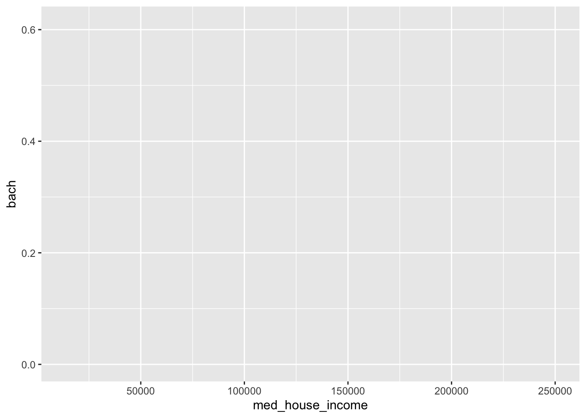
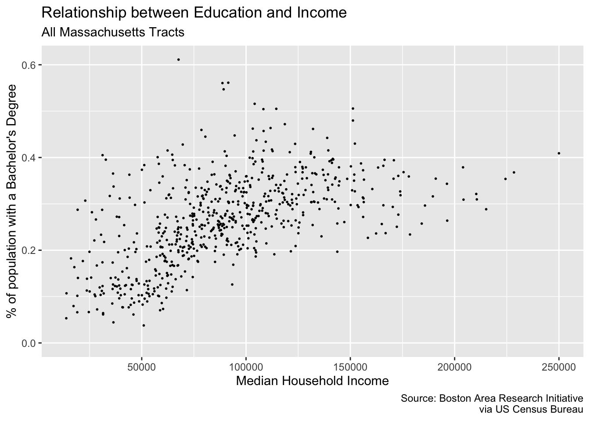
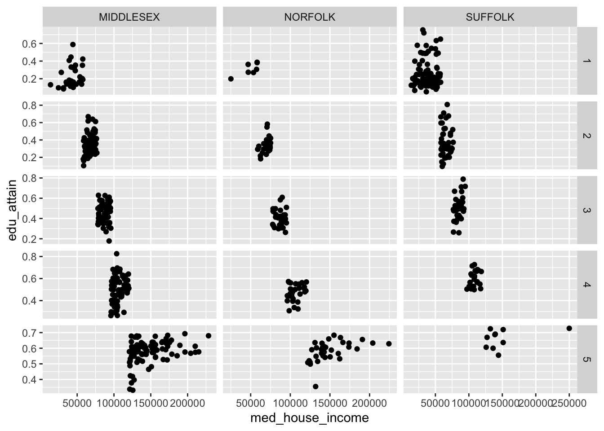

# Grammer of layered graphics II


We've developed a strong foundation for building charts from the ground up by specifying our **defaults** (data, and aesthetic mappings), and adding geom **layers**. In order to take our charts to the next level we need to familiarize ourselves with the other components of the _Layered Grammar of Graphics_: scales, coordinates, and facets.

For these examples we will again return to our commute dataset. We will also recreate the two columns `hh_inc_quin` and `edu_attain`.


```r
library(tidyverse)

commute <- read_csv("data/gba_commute.csv") %>% 
  mutate(hh_inc_quin = ntile(med_house_income, 5),
         edu_attain = bach + master)
```

## Scales 

Recall from _[Grammar of Layered Graphics I](#layered-i)_ that when we supply our aesthetic mappings our axes are filled out automatically.


```r
(p <- ggplot(commute, aes(med_house_income, bach)))
```



By specifying our defaults in the `ggplot()` call, we implicitly are providing the x and y axes. From those mappings, ggplot2 is able to identify the type of variable mapped to each aesthetic and its values. That inference makes it possible for us to plot without having to explicitly state what our axes are.


```r
p <- ggplot(commute, aes(med_house_income, bach)) +
  geom_point(size = 1/3)
```

In the above chart, each column is being mapped as a continuous variable. We are able to manually specify what each scale type is by using the various `scale_*_type()` layers from ggplot2. These layers follow a general format of first specifying `scale` followed by which aesthetic we're scaling, and what data type. For example, to change the `med_house_income` axis to a discrete axis we can apply the layer `scale_x_discrete()`


```r
p +
  scale_x_discrete() 
#> Warning: Removed 8 rows containing missing values (geom_point).
```


In doing so we have lost the axis labels! That is because ggplot2 considers both integers and floating point (numbers with decimals) as continuous and categorical variables as being discrete. 

Nonetheless, we have a lot of functions at our disposal to alter the axes to our liking!

### Transformations

In our data exploration, we will come across non-normal distributions of data. For example income is almost always right skewed and displays some sort of log-normal-ish behavior. We may not want to actually change to underlying values of that variable, but want to apply transformations for the purposes of visualization. In those cases, we can apply scale transformations.

As an example, in our visualization of income and education there is a slight right skew to `med_house_income`. The graphic doesn't justify a logarithmic transformation, but may benefit from a sqrt transformation. We can apply this with `scale_x_sqrt()`.


```r
p +
  scale_x_sqrt() 
#> Warning: Removed 8 rows containing missing values (geom_point).
```


We can apply a log10 transformation as well with `scale_*_log10()`.


```r
p +
  scale_x_log10() 
#> Warning: Removed 8 rows containing missing values (geom_point).
```


This is an overcorrection. The slight upward arch in the original plotting is now inverted. Nonetheless, I hope the point is made. 

In addition to applying transformations, we will want to have more control over the limits of our graph. For example, say we want to have our y axis include all _possible_ values of [0,1]. We can tell ggplot what range of values we want our axes to contain with `lims()`. `lims()` takes a name-value pair where the name is an aesthetic and the value is a numeric vector with two elements—the first being the value at the origin and the second being at the extent of the axis[^lims].

> Note: [0,1] means from 0 inclusive to 1 inclusive. 

We can modify our y axis to have the limits of [0,1] by adding a `lims()` layer where we set the `y` aesthetic to `c(0, 1)`.


```r
p +
  lims(y = c(0, 1))
#> Warning: Removed 8 rows containing missing values (geom_point).
```


The graph we get we when expand our y axis limits definitely contains a bit too much white space. But by expanding ths grid, we can see this sort of flattening out of education at around $150,000 while income still continues to increase. Perhaps if we omit tose values, the relationship may seem even stronger. Let's experiment with that.


* Set the x axis limit to be from [0, 150000]
* Set the y axis limits to be from [0, 0.5]


```r
p +
  lims(
    x = c(0, 150000),
    y = c(0, .5)
    )
```


By changing the extent of our axes this relationship seems much more robust! Such a visualization could spur further validation of this ACS data.

> Remember, ACS data come from samples and sometimes those samples are small. Because of these small sample sizes, we may very well get values that are not properly representative. It is on you to decide whether or not you should include or exclude the values!

### Labeling

The plots we create, while lovely as they are, are somewhat lacking in the labeling department. I would put money on it that no publication would accept plots with labels such as the ones above for sole reason being that our axes titles and scale labels are hard to interpret. 

We've already used it befofe but to be extra clear, to add titles and axis labels to our plots (not adjusting the scale labels) we use a `labs()` layer. With `labs()`, you can label any aesthetic you have mapped as well as adding a `title`, `subtitle`, `caption`, and a `tag`.

Let's add some titles and labels to our plot.


```r
p <- ggplot(commute, aes(med_house_income, bach)) +
  geom_point(size = 1/3) +
    labs(
       y = "% of population with a Bachelor's Degree",
       x = "Median Household Income",
       title = "Relationship between Education and Income",
       subtitle = "All Massachusetts Tracts",
       caption = "Source: Boston Area Research Initiative\nvia US Census Bureau"
      )

p
```



Friends, it's looking pretty good. But there are just two more changes we need to make: our axes labels! The x and y axes labels are meant to illustrate dollar amounts and percentages but respectively. To change the _scale_ labels. we will use some helper functions from the package [`scales`](https://scales.r-lib.org/)

{scales} provides handy functions for taking a variable and altering the labeling to match some other format. In our case, we are interested in printing our `med_house_income` as in a dollar format, i.e. `2000` becomes `\$2,000`, and `bach` as a percentage, i.e. `.4` becomes `%40`. To alter our labels we will use `scales::dollar()`, and `scales::percent()` respectively.

> Isn't it nice how well named functions can be sometimes?

To produce the examples outlined above we would call the function as such:


```r
scales::dollar(2000)
#> [1] "$2,000"
scales::percent(.4)
#> [1] "40%"
```

Now we have an understanding of _how_ the function behaves, but where do we actually change the labels? This is where we come full cirlce back to our `scale_*_continuous()` layer. As we mentioned earlier, `ggplot()` will handle making the scales for us. But `ggplot()` doesn't know how we want to label our variables or how they should appear on the axes. And now the impetus is on us to make these changes manually. To change the axis labels we will specify which axis we are altering using the proper scale layer—i.e. `scale_y_` or `scale_x_`. Then, in each layer we set the `labels` argument to the respective labelling function we want—e.g. `scales::percent` and `scales::dollar`.

> Note: If you append parentheses like you normally would you will get an error. This case we want to ignore them because when they are present, R will try to evaluate that function. Rather, we are interested in providing the _function object_ to the `labels` argument rather than provide it with a vector of output. 


```r
p + 
  scale_x_continuous(labels = scales::dollar) + 
  scale_y_continuous(labels = scales::percent)
#> Warning: Removed 8 rows containing missing values (geom_point).
```


In addition to being able to control the **defaults**, the **layers**, and now the **scales** you are well equipped to create and manipulate your own plots. 

## Coordinates

While you're likely to create 98% of your visualizations without ever manipulating the coordinates, it is still good knowledge to have! 

As we have mentioned and alluded to, we are working in a two-dimensional space—meaning with x and y coordinates. When working in two-dimensions, thee cartesian plane is the natural choice for a coordinate reference system. In all of our plots, this has been the default. Behind the scenes, ggplot is essentially adding a `coord_cartesian()` layer to your plot.

> Think of this much of the same way that your scales are inferred.

If, however, we find the need to alter or manipulate the coordinate system the tools are available to us. We've actually already used one, `coord_flip()`. Like, with scales, all coordinate based functions are prefixed with `coord_()`. If you will need to use these coordinate layers, it will be to essentially change the aspect ratio of your plots.

We will encounter coordinates much more when we talk about spatial data. For now, though, all you need to know is that they exist and are a major underlying part of your plots.


## Facets

The last portion of the grammar to visit is facetting. When we facet a plot we are creating what are called  "small multiples", a term coined by the prominent Edward Tufte. A facetting, in other words, creates a graph for each unique level in a categorical variable. Think of this like a `group_by()` for plotting.

There are two types of facetting we can do: wrapped and grid. These are done with `facet_wrap()` and `facet_grid()` respectively. The reference documentation sums up the differences best:

> "`facet_grid()` forms a matrix of panels defined by row and column faceting variables. It is most useful when you have two discrete variables, and all combinations of the variables exist in the data. If you have only one variable with many levels, try `facet_wrap()`."[^facet]

Let's look at `facet_wrap()` first. To create the facetting, we need to add `facet_wrap()` as a layer to our existing plot. There is only one argument that we are required to fulfill and that is the `facet` argument. `facet` expects a set of variables defined by the `vars()` function. `vars()` is a function used throughout the tidyverse to specify which columns are to be referenced used within the context of a the function it's being used in. 

To recreate the above plot but facetting by county, we would add `facet_wrap(vars(county))` as a layer to our plot.


```r
p <- commute %>% 
  filter(!is.na(hh_inc_quin)) %>% 
  ggplot(aes(med_house_income, edu_attain)) +
  geom_point() 

p +
  facet_wrap(vars(county))
```


With `facet_wrap()` we are able to explicitly state how many rows or columns of plots there should be. The defaults may be nice, but it's always good to be explicit about our expecvtations! We set the `nrow` or `ncol` argument to do this. Since our above example defaulted to `ncol = 3`, let's try this with three rows.


```r
p +
  facet_wrap(vars(county), nrow = 3)
```


The grid works a little bit differenly. Rather than specifying which columns to facet on and the number of rows or columns, we can create a grid (or matrix) of small multiples. With `facet_grid()` we use the `rows` and `cols`. 

We can recreate our above graphs by passing `vars(county)` to  either `rows` or `cols`. But where `facet_grid()` shines is when you have data in every pairing of two categorical variables. For example we can we create a facet for each combination of `county` and `hh_inc_quin`. 


```r
p +
  facet_grid(cols = vars(county),
             rows = vars(hh_inc_quin))
```


When we create facets, each panel has shares the same scales. We can change this by setting the `scales` argument to one of `"free"`, `"free_x"`, or `"free_y"`. These in essence, "free up" the scales for each panel. We can choose to share the scales on the x axis by setting `scales = "free_y"` or vice versa.


```r
p +
  facet_grid(cols = vars(county),
             rows = vars(hh_inc_quin),
             scales = "free")
```




> Note: the behavior of `scales = "free"` changes behavior when set in the context of `facet_wrap()` vs `facet_grid()`. The former frees the scales for each panel. The latter frees the scales for either a column or row of panels. 


It is also important to note that what we have gone through is by no means exhaustive. You should, at minimum, familiarize yourself with both `scale_*_reverse()`, and `scale_*_binned()` in your spare time. There are dozens, if not hundreds, of ggplot2 functions to suit your every whim. And, as you have already briefly seen, the ggplot function universe is not relegated to just ggplot2. There are many other packages which have built custom geoms and other enhancements that may benefit you. 


[^lims]: https://ggplot2.tidyverse.org/reference/lims
[^facet]: https://ggplot2.tidyverse.org/reference/facet_grid.html
  
