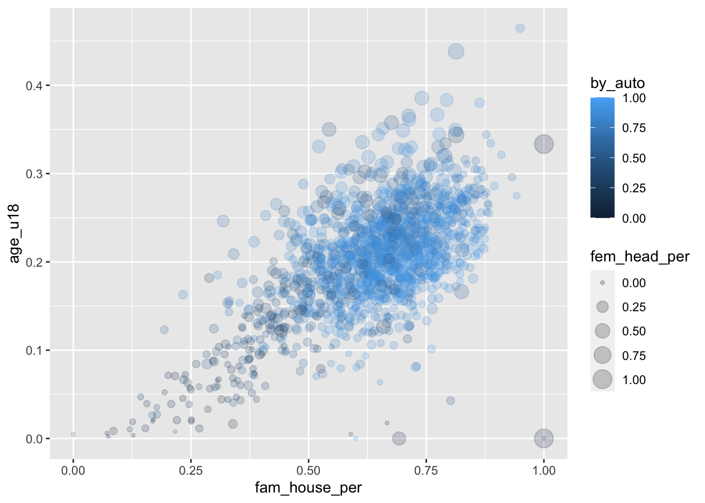

# Visualizing beyond 2-dimensions


Over the duration of the last three chapters we have cultivated a fundamental understanding of the grammar of graphics and have discussed how to craft univariate visualizations and explore bivariate relationships. In those graphics we have not gone beyond two-dimensions. We only utilized two aesthetics to map. Howver, there is many more that we can incorporate into our visualizations which will in turn enable us to explore three or for variables at once.

> Note that these will not be 3D, but rather visualize three variables. 

To improve our graphics we will utilize the color, shape and size aesthetics as well as faceting. Of course, this begs the question of which aesthetic do I choose? Well, that depends upon what type of data you will be visualizing.

Generally, if you want to visualize a continuous variable, color and then size will be preferable.


we can utilize color, size, and shape to tell a better story with our graphics. 
Each aesthetic can serve a different purpose / used for a different kind of variable

- color (continuous or discrete)
- size (continuous)
- shape (discrete) 

others:
- linetype 

To cover:

- coloring / filling
- shaping
- sizing
- faceting

## Expanding bivariate visualizations to trivariate & other tri-variate


- we can visualize other vcariables by setting further aesthetics.
  - can set the color or fill, size, and shape
- we alreay did this previously when we set the color, let's do that here. 
  - lets see how commuting by walking changes with the family house and under 18 pop
    - set the color argument of the `aes()` function as `color = by_walk`
      - it's important you do this within the aesthetics function 
    

```r
ggplot(acs_raw, aes(fam_house_per, age_u18, color = by_auto)) +
  geom_point()
## Warning: Removed 17 rows containing missing values (geom_point).
```


- we can add size to this as well by setting the `size` aesthetic
  - lets see if the more female headed house holds there are affects commuting by car as minors increases


```r
ggplot(acs_raw, aes(fam_house_per, age_u18, color = by_auto, size = fem_head_per)) +
  geom_point(alpha = .2)
## Warning: Removed 17 rows containing missing values (geom_point).
```



- from this chart we can see quite a few things:
  - as `fam_house_per` increases so does the under 18 pop,
  - as both `age_u18` and `fam_house_per` increase so does the rate of communiting by car
  - as both `age_u18` and `fam_house_per` so does female headed houses, but to a lesser degree
  - this gives us a good idea of some relationships that we can test with our data at a later point


```r
minors_lm <- lm(age_u18 ~ fam_house_per + by_auto + fem_head_per, data = acs_raw)

huxtable::huxreg(minors_lm)
## Registered S3 methods overwritten by 'broom.mixed':
##   method         from 
##   augment.lme    broom
##   augment.merMod broom
##   glance.lme     broom
##   glance.merMod  broom
##   glance.stanreg broom
##   tidy.brmsfit   broom
##   tidy.gamlss    broom
##   tidy.lme       broom
##   tidy.merMod    broom
##   tidy.rjags     broom
##   tidy.stanfit   broom
##   tidy.stanreg   broom
```

<!--html_preserve--><table class="huxtable" style="border-collapse: collapse; margin-bottom: 2em; margin-top: 2em; width: 50%; margin-left: auto; margin-right: auto;  ">
<col><col><tr>
<td style="vertical-align: top; text-align: center; white-space: nowrap; border-style: solid solid solid solid; border-width: 0.8pt 0pt 0pt 0pt; padding: 4pt 4pt 4pt 4pt;"></td>
<td style="vertical-align: top; text-align: center; white-space: nowrap; border-style: solid solid solid solid; border-width: 0.8pt 0pt 0.4pt 0pt; padding: 4pt 4pt 4pt 4pt;">(1)</td>
</tr>
<tr>
<td style="vertical-align: top; text-align: left; white-space: nowrap; padding: 4pt 4pt 4pt 4pt;">(Intercept)</td>
<td style="vertical-align: top; text-align: right; white-space: nowrap; padding: 4pt 4pt 4pt 4pt;">-0.007&nbsp;&nbsp;&nbsp;&nbsp;</td>
</tr>
<tr>
<td style="vertical-align: top; text-align: left; white-space: nowrap; padding: 4pt 4pt 4pt 4pt;"></td>
<td style="vertical-align: top; text-align: right; white-space: nowrap; padding: 4pt 4pt 4pt 4pt;">(0.005)&nbsp;&nbsp;&nbsp;</td>
</tr>
<tr>
<td style="vertical-align: top; text-align: left; white-space: nowrap; padding: 4pt 4pt 4pt 4pt;">fam_house_per</td>
<td style="vertical-align: top; text-align: right; white-space: nowrap; padding: 4pt 4pt 4pt 4pt;">0.229 ***</td>
</tr>
<tr>
<td style="vertical-align: top; text-align: left; white-space: nowrap; padding: 4pt 4pt 4pt 4pt;"></td>
<td style="vertical-align: top; text-align: right; white-space: nowrap; padding: 4pt 4pt 4pt 4pt;">(0.010)&nbsp;&nbsp;&nbsp;</td>
</tr>
<tr>
<td style="vertical-align: top; text-align: left; white-space: nowrap; padding: 4pt 4pt 4pt 4pt;">by_auto</td>
<td style="vertical-align: top; text-align: right; white-space: nowrap; padding: 4pt 4pt 4pt 4pt;">0.042 ***</td>
</tr>
<tr>
<td style="vertical-align: top; text-align: left; white-space: nowrap; padding: 4pt 4pt 4pt 4pt;"></td>
<td style="vertical-align: top; text-align: right; white-space: nowrap; padding: 4pt 4pt 4pt 4pt;">(0.007)&nbsp;&nbsp;&nbsp;</td>
</tr>
<tr>
<td style="vertical-align: top; text-align: left; white-space: nowrap; padding: 4pt 4pt 4pt 4pt;">fem_head_per</td>
<td style="vertical-align: top; text-align: right; white-space: nowrap; padding: 4pt 4pt 4pt 4pt;">0.228 ***</td>
</tr>
<tr>
<td style="vertical-align: top; text-align: left; white-space: nowrap; padding: 4pt 4pt 4pt 4pt;"></td>
<td style="vertical-align: top; text-align: right; white-space: nowrap; border-style: solid solid solid solid; border-width: 0pt 0pt 0.4pt 0pt; padding: 4pt 4pt 4pt 4pt;">(0.012)&nbsp;&nbsp;&nbsp;</td>
</tr>
<tr>
<td style="vertical-align: top; text-align: left; white-space: nowrap; padding: 4pt 4pt 4pt 4pt;">N</td>
<td style="vertical-align: top; text-align: right; white-space: nowrap; padding: 4pt 4pt 4pt 4pt;">1459&nbsp;&nbsp;&nbsp;&nbsp;&nbsp;&nbsp;&nbsp;&nbsp;</td>
</tr>
<tr>
<td style="vertical-align: top; text-align: left; white-space: nowrap; padding: 4pt 4pt 4pt 4pt;">R2</td>
<td style="vertical-align: top; text-align: right; white-space: nowrap; padding: 4pt 4pt 4pt 4pt;">0.547&nbsp;&nbsp;&nbsp;&nbsp;</td>
</tr>
<tr>
<td style="vertical-align: top; text-align: left; white-space: nowrap; padding: 4pt 4pt 4pt 4pt;">logLik</td>
<td style="vertical-align: top; text-align: right; white-space: nowrap; padding: 4pt 4pt 4pt 4pt;">2550.558&nbsp;&nbsp;&nbsp;&nbsp;</td>
</tr>
<tr>
<td style="vertical-align: top; text-align: left; white-space: nowrap; border-style: solid solid solid solid; border-width: 0pt 0pt 0.8pt 0pt; padding: 4pt 4pt 4pt 4pt;">AIC</td>
<td style="vertical-align: top; text-align: right; white-space: nowrap; border-style: solid solid solid solid; border-width: 0pt 0pt 0.8pt 0pt; padding: 4pt 4pt 4pt 4pt;">-5091.116&nbsp;&nbsp;&nbsp;&nbsp;</td>
</tr>
<tr>
<td colspan="2" style="vertical-align: top; text-align: left; white-space: normal; padding: 4pt 4pt 4pt 4pt;"> *** p &lt; 0.001;  ** p &lt; 0.01;  * p &lt; 0.05.</td>
</tr>
</table>
<!--/html_preserve-->


Trivariate:

- grouped / stacked bar charts
- heatmaps 


Color Ramps:

- diverging when there is a true middle
- dark is low bright is high


- most data analyses start with a visualization. 
- the data we have will dictate the type of visualizations we create
- there are many many different ways in which data can be represented
- generally these can be bucketed into a few major categories
  - numeric 
    - integer
    - double
  - character 
    - think groups, factors, nominal, anything that doesn't have a numeric value that makes sense to count, aggregate, etc.
  - time / order 
  
-------


Notes:

https://extremepresentation.typepad.com/files/choosing-a-good-chart-09.pdf
