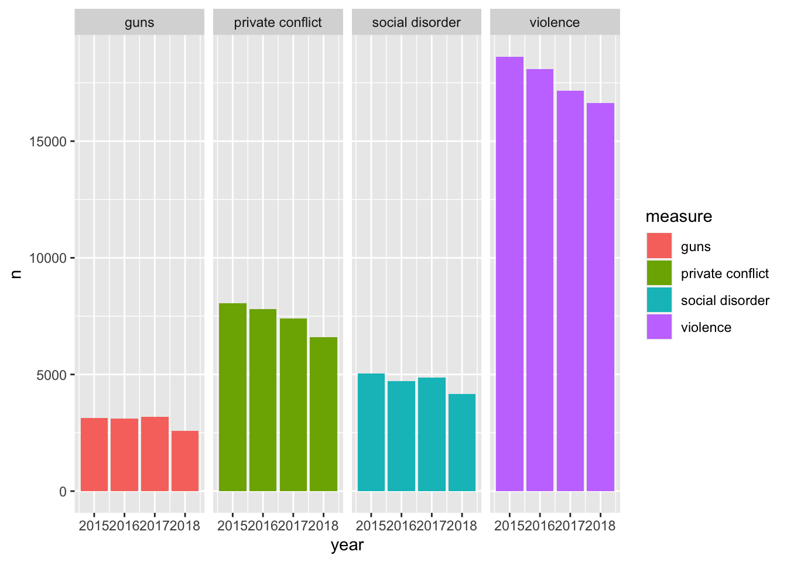
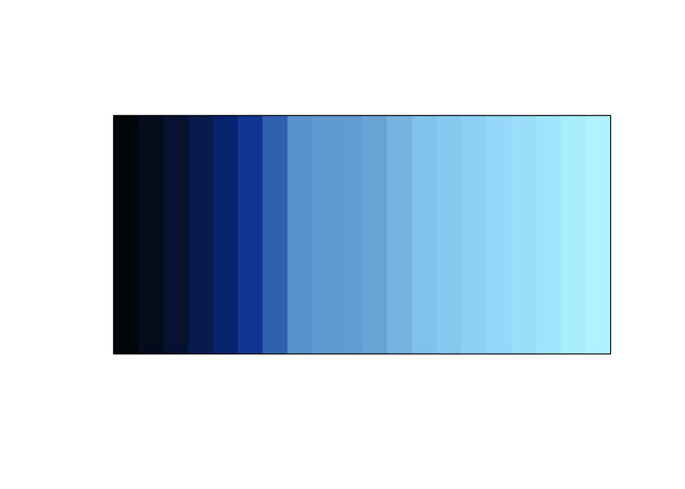
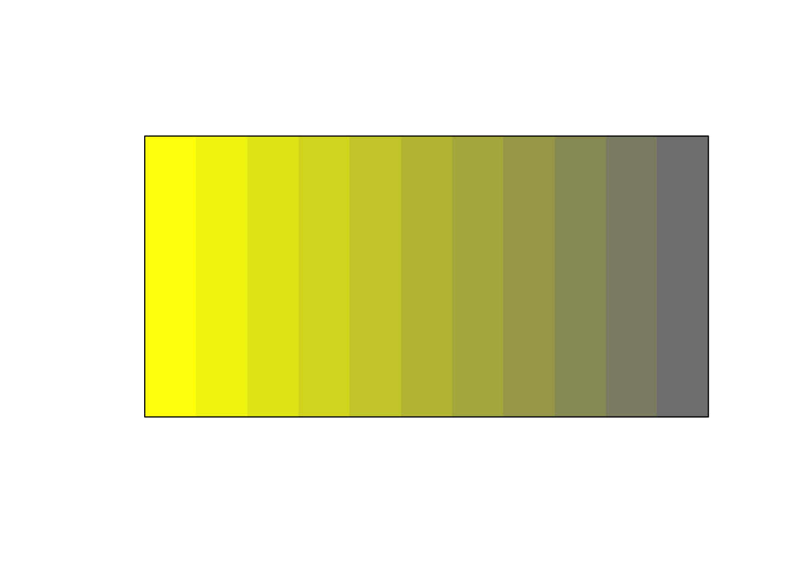
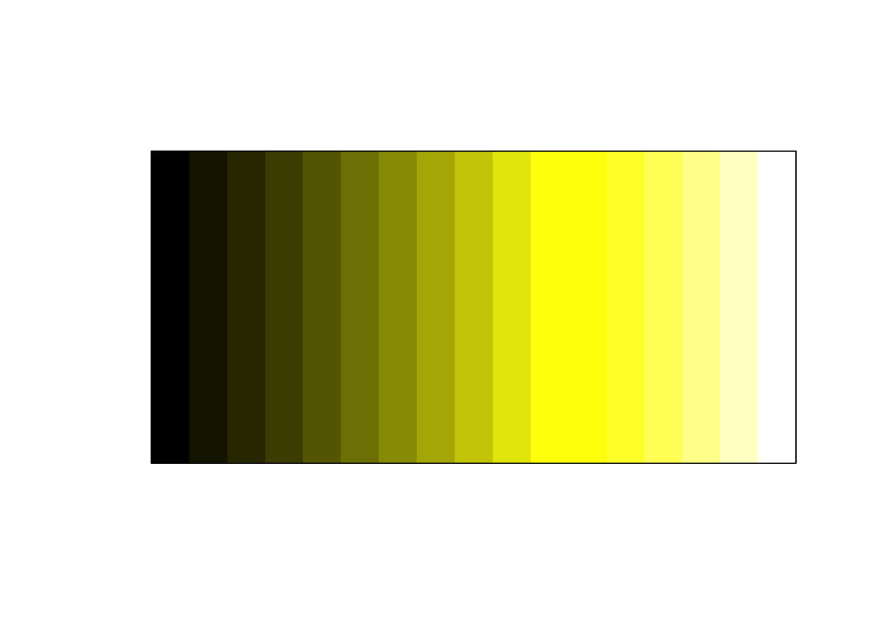
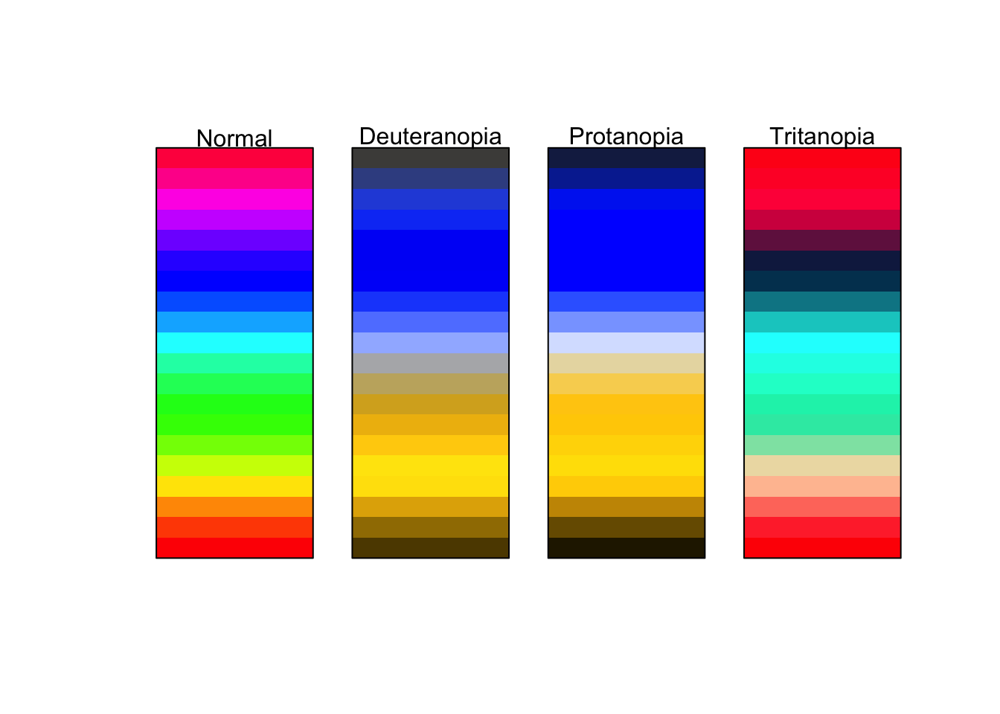
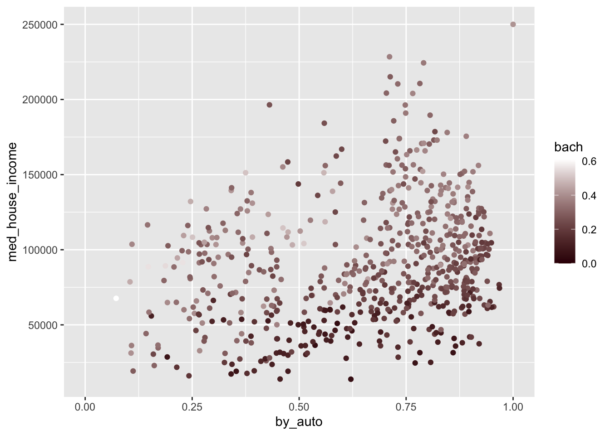
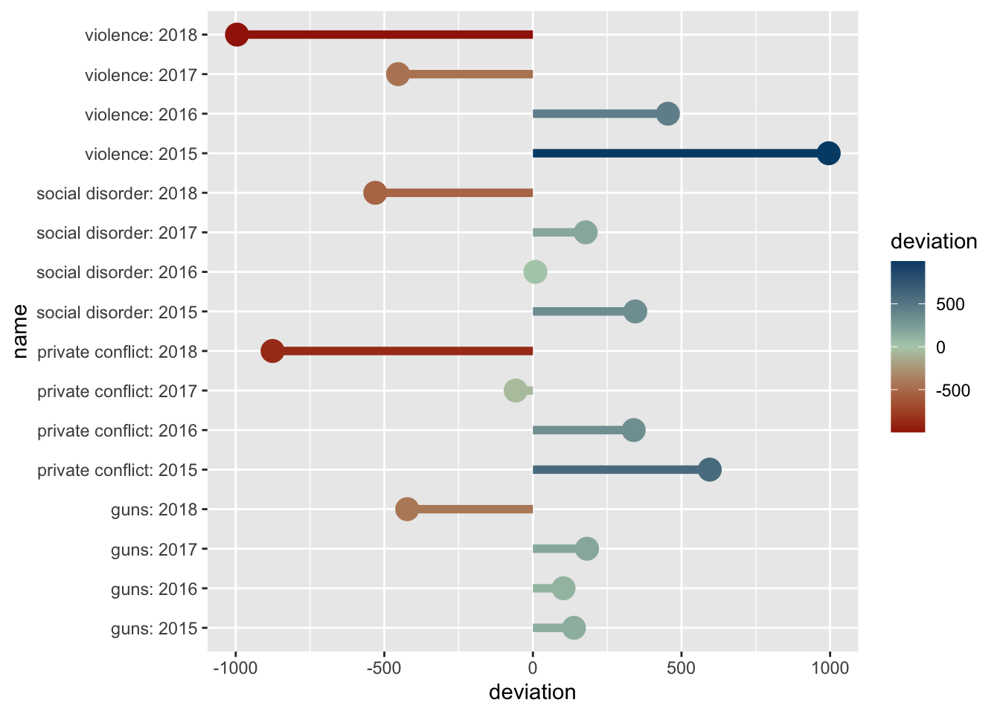

# Visualizing beyond 2-dimensions


Over the duration of the last three chapters we have cultivated a fundamental understanding of the grammar of graphics and have discussed how to craft univariate visualizations and explore bivariate relationships. In those graphics we have not gone beyond two-dimensions. We only utilized two aesthetics to map. Howver, there is many more that we can incorporate into our visualizations which will in turn enable us to explore three or for variables at once.

> Note that these will not be 3D, but rather visualize three variables. 

To improve our graphics we will utilize the color, shape, and size aesthetics, as well as faceting. Of course, this begs the question of which aesthetic do I choose? Well, that depends upon what type of data you will be visualizing. Each aesthetic serves different purposes and can be used for a different type of variable.

In general we can use the below mappings: 

- color -> continuous or discrete
- size -> continuous
- shape -> discrete

## Color

Let us first take a look at the use of color. Color is, after position, the easiest visual cue for we humans to distinguish (that viz book on my coffee table) between. It is also a rather versatile visual cue as it can be used to address both continuous and discrete variables. We will first explore the use of color for discrete measurements. In this context, I do not necessarily mean discrete as in integers, but more or less groups. This is where there is not _necessarily_ an order or scale implied in the data. It _can_ however be indicative of order—think for example age groups. To explore the use of color for groups or discrete data, we will look at Boston ecometrics of social disorder as discussed previously (O'Brien 2015 CITE NEEDED). Ecometrics are stored in a file called `ecometrics.csv` the `data` directory. Read it in as `ecometrics`. 


```r
library(tidyverse)

ecometrics <- read_csv("data/ecometrics.csv")
```


At this point in your learning, I think it is appropriate to introduce you to a new package that can be used to quickly summarize and visualize your data. That is called `skimr`. Within the package there is a function called `skim()`. This package is really useful for quickly getting an understanding of a dataset as it provides useful summary statistics for each variable as well as a histogram for numeric columns. 


```r
skimr::skim(ecometrics)
```


```
#> ── Data Summary ────────────────────────
#>                            Values    
#> Name                       ecometrics
#> Number of rows             68        
#> Number of columns          4         
#> _______________________              
#> Column type frequency:               
#>   character                2         
#>   numeric                  2         
#> ________________________             
#> Group variables            None      
#> 
#> ── Variable type: character ────────────────────────────────────────────────────
#>   skim_variable n_missing complete_rate   min   max empty n_unique whitespace
#> 1 type                  0             1     5    34     0       15          0
#> 2 measure               0             1     4    16     0        4          0
#> 
#> ── Variable type: numeric ──────────────────────────────────────────────────────
#>   skim_variable n_missing complete_rate  mean      sd    p0   p25   p50   p75
#> 1 year                  0             1 2016.    1.13  2015 2016. 2016. 2017.
#> 2 n                     0             1 1929. 1857.      68  786  1230  2690.
#>    p100 hist 
#> 1  2018 ▇▇▁▇▇
#> 2  7392 ▇▂▁▁▁
```

A simple graphic here would be to evaluate the raw counts by year. A simple bar chart would look like this.


```r
ggplot(ecometrics, aes(year, n)) +
  geom_col()
```


But, we are aware that there are different measurements. These were described previously and can be seen below.


```r
distinct(ecometrics, measure)
#> # A tibble: 4 x 1
#>   measure         
#>   <chr>           
#> 1 violence        
#> 2 guns            
#> 3 private conflict
#> 4 social disorder
```

How can we partition our visualization to illustrate the number of counts per ecometric per year? We can use color—each measurement will receive it's own color. This will make it easier to determine the frequency of which each ecometric occurs. To do this we setting `fill` rather than `color` this is because we are working with a polygon shape. `color` is used in working with lines and points. A useful trick is to think of `color` as the border and `fill` as the body fill. 


```r
ggplot(ecometrics, aes(year, n, fill = measure)) +
  geom_col()
```


By mapping the fill to the `measure` variable we were able to create a stacked bar chart! It is apparent that `violence` is the most frequent of these ecometrics, followed by `private conflict`, `social disorder`, and then `guns`. 

One of the downsides about the stacked barchart is that it is difficult to compare the sizes of each group relative to ones that are not adjacent. For example comparing `guns` to `social disorder` is made difficult as `private conflict` is situated between them. We can adjust our chart so that each bar is situated next to eachother. We do this by setting the argument `position = "dodge"` within the `geom_col()` layer.


```r
ggplot(ecometrics, aes(year, n, fill = measure)) +
  geom_col(position = "dodge")
```


The dodged bar chart makes it much easier to compare the heights of each bar. But now we are creating a somewhat cluttered graphic. In the situation where there are multiple groups and subgroups, it is often preferred to utilize facetting because the most important thing in any graphic is how easy it is to consume. We would rather make four plots than one messy plot. 

Let's facet by `measure` and tell `facet_wrap()` to create only one row. 


```r
ggplot(ecometrics, aes(year, n, fill = measure)) +
  geom_col() + 
  facet_wrap("measure", nrow = 1)
```


This is awesome! We have four different plots one for each measurement and it is extremely easy to see how each ecoemtrics has trended over the four year period. It seems like there has been a steady decrease! With this plot, however, we are labeling the ecometrics twice: once with the panel label and once with the legend. Since each facet is labeled individually and are not situated next to any other ecometrics, the color becomes redundant. Unless there is an important reason to visualize the color when faceting, it is most likely not needed. As such, a final visualization would look like below.


```r
ggplot(ecometrics, aes(year, n)) +
  geom_col() + 
  facet_wrap("measure", nrow = 1)
```



### Continuous color scales

In the cases where our variable of interest is a continuous numeric one, we ought to be using a continuous color scale. These are scales that change from one color to another to illustrate a range of values—for example we could use this to visualize probabilities from 0 - 1. The below is an example of one of these color palettes. 


Often you'll encounter visualizations that use a rainbow color palette or some other number of colors. To illustrate a range of values. This is _not_ recommended. When we are looking at color, we are best able to detect changes in the luminescence (perceived brightness) and saturation [^flowingdata]. As such, we should work with color palettes that are easiest to interpret. First we'll visualize what changing saturation and brightness looks like. 

Below is is an image of 10 colors. Starting at the left is the color yellow (hex code `#FFFF00FF`). Each step it is desaturated by 10 percent ending with the color grey (hex code `#808080FF`). We can think of saturation as how much color there is.



Below is an example of what changing the brightness can look like.


If we put all of these together we can get something that looks like the below.


You may find that in the course of your work that individuals will use a color palette like the below.


```r
prismatic:::plot.colors(rainbow(20))
```



I strongly **advise against** this. These colors make it extremely difficult to tell changing values. Consider for a moment how you would try and tell the difference in numeric value between a magenta and a maroon. It would be rather difficult. Moreover, this color palette is not very accessible to those who are color deficient. The below is an approximation of what those with varying types of color blindness might see. 


Compare this with the earlier example of dark to light yellows.




This is much more accessible to those who are color deficient as well as providing a clearer understanding of a _range_ of values.

#### Example

To explore this in R, we will return to the commute data set we created from BARI's Census Indicators very early on. We will visualize the relationship of commuting by automobile and median household income. Moreover, we will color each point by the rate of Bachelor's degree attainment. As educational attainment tends to increase with income, we should expect the coloring to somewhat follow household income. 

Create the visualization following the below steps. 

* Read in `data/gba_commute.csv`
* Plot `med_house_income` against (on the y axis) `by_auto`
* Color the plot by `bach`
* Add the appropriate geometry


```r
commute <- read_csv("data/gba_commute.csv")

(p <- ggplot(commute, aes(by_auto, med_house_income, color = bach)) +
  geom_point())
```


Wonderful! As anticipated, the color of the points are darkest at the bottom where median household income is the lowest. And as income increases, so does the brightness and saturation of our color scale. If we return to the grammar of graphics, we can take further control of the scales. In this case, the color of the scales. One of the ways we can change the color scale is to add the layer `scale_color_gradient()` to manually choose what colors to use in our scale. This provides a lot of flexibility to you as a information designer. Think of how you can use the color to represent what it is thatyou are visualizing. Or, how you can use colors to adhere to a color palette of your own or an organization you are working with. 

`scale_color_gradient()` allows us to provide the colors for low values and high values. In general, you should choose a darker color to represent lower values and brighter colors for higher values. Below we add the layer and provide color codes. 

> You can find color codes via google by searching "color picker." Or, you can use any number of free color palette generators online. I am personally a fan of [coolors.co](https://coolors.co).  

Below we've changed the plot to transition from a dark red to a white as values increase. 


```r
p +
  scale_color_gradient(low = "#360002", high = "white")
```


Try modifying the above plot by picking two colors that you think do a good job of visualizing a range of values.

#### Diverging colors

There are many a time when our variable of interest has a middle value and illustrating the center as well as the deviation from that center is important. To visually represent this we use what is called a diverging color scale. Diverging color scales are characterized by a middle color from which both ends of the spectrum originate. The center is to represent some middle value. If we contextualize this as z-scores and the color palette below, the center would be `0` and any negative scores would trend towards red. Whereas if they trended positive they would become more blue.



One thing to be wary of is using a divergent color scale when it is not necessary. This is an easy trap to fall into since they're pretty cool. Remember, _only_ use diverging color palettes if there is an existing middle value.

#### Example

Take our ecometrics again. Say we are interested in what the annual deviation is from the sample mean—the average for all years—of each ecometric. This is the perfect use case for a diverging color scale. This will require a bit of computational creativity. So lets work through this. 

Let's think about each of the measures we need to calculate. We need to:


- Find the number of counts for each year by ecometric.
- Find the average count for all years for each ecometric.
- Identify the deviation from the mean.

We will work through this sequentially. First and foremost we need to calculate the total number of crime reports by ecometric by year. The dataset has more than one observation per year per ecometric. We can see this by running a quick count.


```r
count(ecometrics, measure, year)
#> # A tibble: 16 x 3
#>    measure           year     n
#>    <chr>            <dbl> <int>
#>  1 guns              2015     5
#>  2 guns              2016     5
#>  3 guns              2017     5
#>  4 guns              2018     5
#>  5 private conflict  2015     4
#>  6 private conflict  2016     4
#>  7 private conflict  2017     4
#>  8 private conflict  2018     4
#>  9 social disorder   2015     3
#> 10 social disorder   2016     3
#> 11 social disorder   2017     3
#> 12 social disorder   2018     3
#> 13 violence          2015     5
#> 14 violence          2016     5
#> 15 violence          2017     5
#> 16 violence          2018     5
```
We need to tidy this up and ensure that each row is only one observation—in this case one ecometric per year—with the total count. The logic to accomplish this is to first `group_by()` _both_ `measure` and `year` and then sum the `n` values. As such:


```r
ecometrics %>% 
  group_by(measure, year) %>% 
  summarise(n = sum(n))
#> # A tibble: 16 x 3
#> # Groups:   measure [4]
#>    measure           year     n
#>    <chr>            <dbl> <dbl>
#>  1 guns              2015  3146
#>  2 guns              2016  3111
#>  3 guns              2017  3190
#>  4 guns              2018  2585
#>  5 private conflict  2015  8063
#>  6 private conflict  2016  7807
#>  7 private conflict  2017  7410
#>  8 private conflict  2018  6592
#>  9 social disorder   2015  5043
#> 10 social disorder   2016  4707
#> 11 social disorder   2017  4876
#> 12 social disorder   2018  4168
#> 13 violence          2015 18621
#> 14 violence          2016 18080
#> 15 violence          2017 17172
#> 16 violence          2018 16630
```
One of the dplyr quirks is that after you `summarise()`, one level of grouping is removed. This is because we have already performed our aggregate measure and the last level of grouping is now unit of analysis (a row). Since we are currently grouped at the `measure` level and each row represent one year we are already ready to calculate the average `n` value by group. Rather than using `summarise()` as we are used to doing with summary statistics, we will use `mutate()` and create a column called `avg` with the average `n` value for each group. This is because we want to be able to perform a column-wise operation to subtract the average from each row's `n` value. 

I continue by creating three new columns. The first is `avg` which is set to the mean of `n` by group. Since the resulting value of `mean(n)` is a single value, each observation in the group gets that value. Second, I create a new column called `deviation` which subtracts the new column we created from the `n` column. The lastly I created a new column to contain the name of the ecometric as well as the year. This is done to ensure that in the visualization each row can be plotted.


```r
annual_metrics <- ecometrics %>% 
  # group by measure and year
  group_by(measure, year) %>% 
  # find the total n for each measure and year
  # summarise loses the last level of grouping
  summarise(n = sum(n)) %>% 
  mutate(
    # calculate average `n` by ecometric
    avg = mean(n),
    # calculate the deviation from the mean 
    deviation = n - avg,
    # creating a new column that combines the name of the ecometric and the year
    name = glue::glue("{measure}: {year}"),
  ) 
```

I snuck in a new package right there. `glue` is a package that let's us incorporate R expressions with plain text. Whatever is inside of the brackets `{` will be run as an R expression. So since I referenced the columns `measure` and `year` as `"{measure}: {year}"` each value of `name` will look something like `social disorder: 2017`.

Now that we have a data frame with all of the values we want to plot, let's go ahead and do that! We will use a lollipop chart here to do so. 

> Remember that `geom_lollipop()` comes from the `ggalt` package. We can use the function without loading the whole package by referencing the `pkgname::function_name()`.

Within the chart we map `devation` to the color aesthetic. 


```r
(p <- ggplot(annual_metrics, aes(y = deviation, x = name, color = deviation)) + 
  ggalt::geom_lollipop(size = 2) + 
  coord_flip())
#> Registered S3 methods overwritten by 'ggalt':
#>   method                  from   
#>   grid.draw.absoluteGrob  ggplot2
#>   grobHeight.absoluteGrob ggplot2
#>   grobWidth.absoluteGrob  ggplot2
#>   grobX.absoluteGrob      ggplot2
#>   grobY.absoluteGrob      ggplot2
```


The above graphic doesn't take into account the middle value of `0`. Because of this, we need to tell ggplot2 that this is a diverging color scale. When we were working with a normal continuous color scale we used `scale_color_gradient()`. Instead, since we have a middle value, to  create the diverging color gradient we use `scale_color_gradient2()`. This adds two more arguments `mid` and `midpoint`. The former is the color of that middle value. The second is what that middle value maps to—defaults to 0, which is fine for our example. 

Now if we add the below colors—a red, yellow-ish beige, and a blue—we will have a diverging color scale on the plot! 


```r
p + 
  scale_color_gradient2(low = "#A12106", mid = "#B2CEB7", high = "#004C76")
```


Information design is a seemingly endless field of which we only touched on a very small amount. The R community has put a lot of work into enabling the use of color for visualization purposes. The above images of color palettes were created with the help of the wonderful packages `prismatic` and `paletteer`

To explore color more check out the packages [`prsimatic`](https://github.com/EmilHvitfeldt/prismatic) and [`paletteer`](https://github.com/EmilHvitfeldt/paletteer) by [Emil Hvitfeld](https://www.hvitfeldt.me/blog/). He


## Shape

- another way of visualizing categories in our data is by shape. 
- only do this if color is not an option
- it is more difficult for the eyes to pick up on
- can be somewhat distracting
- please do not map both color and shape to the same variable, that is redundant, and adds too much complexity to the visual.

- lets use some airbnb data. you will get more comfortable with this data later on in the section on spatial analysis
- the simple dataset exists in `data/airbnb/airbnb.csv`.
- read that in. For the sake of simplicity we will filter our data down to only Back Bay.
- we will then visualize the points by their place in space—aka their longitude and latitude.
- mapping shape tothe room type. This will help us see where these room types are located.


```r
airbnb <- read_csv("data/airbnb/airbnb.csv")
#> Parsed with column specification:
#> cols(
#>   id = col_double(),
#>   neighborhood = col_character(),
#>   room_type = col_character(),
#>   price = col_double(),
#>   longitude = col_double(),
#>   latitude = col_double()
#> )

bb <- airbnb %>% 
  filter(neighborhood == "Back Bay") 


ggplot(bb,  aes(longitude, latitude, shape = room_type)) + 
  geom_point(alpha = .5, size = 3) 
```




- compare this with the use of color for looking at groups


```r
bb_s <- ggplot(bb,  aes(longitude, latitude, shape = room_type)) + 
  geom_point(alpha = .5, size = 3) +
  theme(legend.position = "none") + 
  labs(x = "", y = "")


bb_c <- ggplot(bb,  aes(longitude, latitude, color = room_type)) + 
  geom_point(alpha = .5, size = 3) +
  theme(legend.position = "none") + 
  labs(x = "", y = "")

bb_s / bb_c 
```


- which do you prefer?
- which getsthe message accross better?
- again, we are delving into the world of design and there is never a "correct" answer, but sometimes there may be a consensus. Just do what you think is best and be open to constructive feedback

### size 

To cover:

- coloring / filling
- shaping
- sizing
- faceting

## Expanding bivariate visualizations to trivariate & other tri-variate


Notes:

https://extremepresentation.typepad.com/files/choosing-a-good-chart-09.pdf

[^flowingdata](https://flowingdata.com/2008/04/29/why-should-engineers-and-scientists-care-about-color-and-design/)
