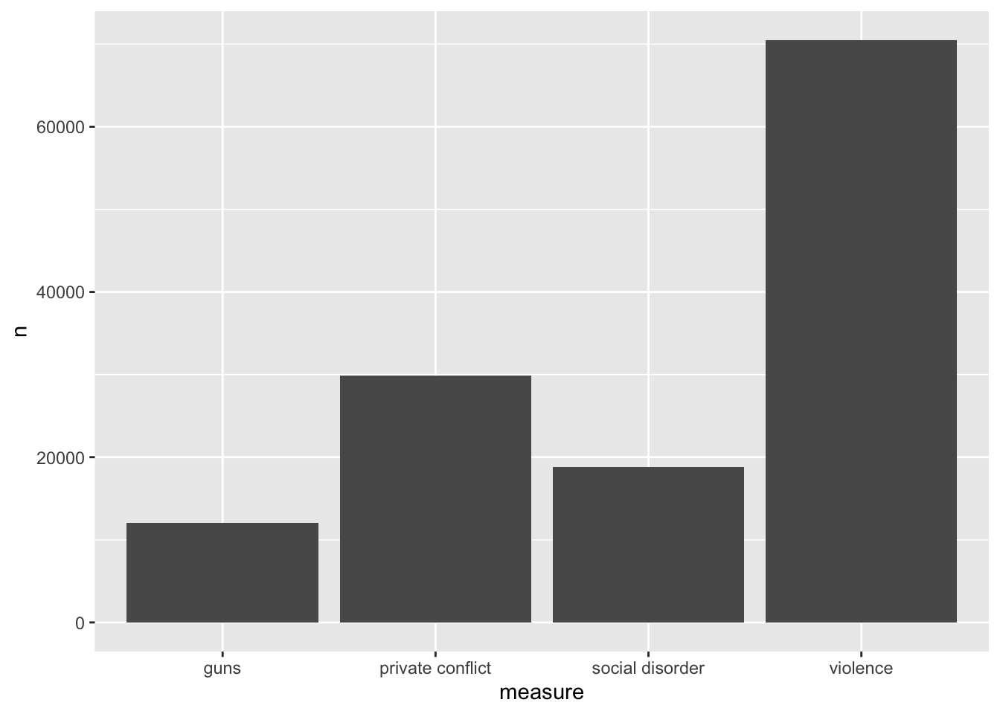
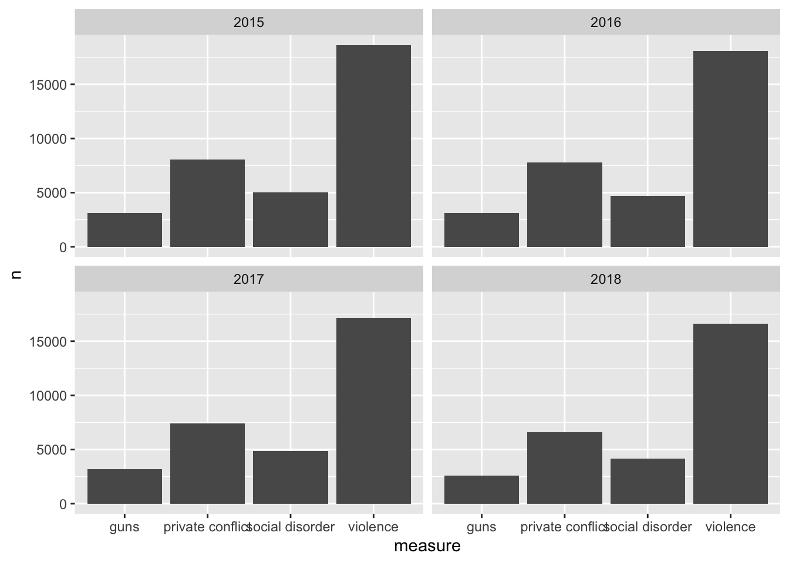
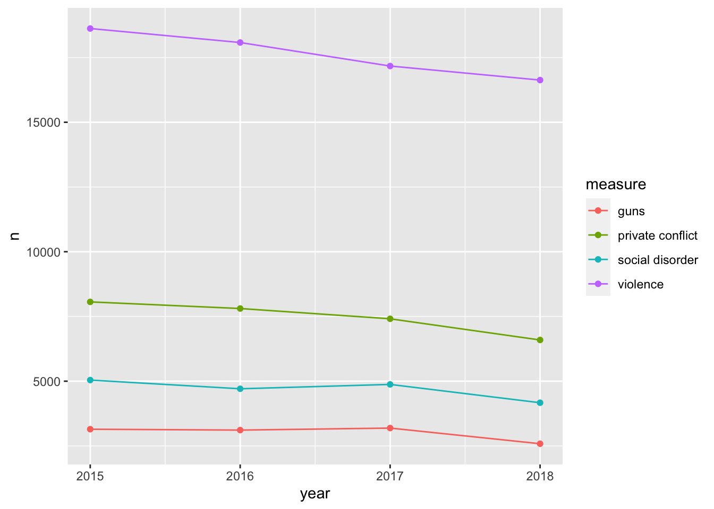

# Visualizing through time


```r
library(tidyverse)
```

```
## ── Attaching packages ──────────────────────────────────────────────────────────────────────────── tidyverse 1.3.0 ──
```

```
## ✓ ggplot2 3.3.0     ✓ purrr   0.3.3
## ✓ tibble  3.0.0     ✓ dplyr   0.8.5
## ✓ tidyr   1.0.2     ✓ stringr 1.4.0
## ✓ readr   1.3.1     ✓ forcats 0.5.0
```

```
## ── Conflicts ─────────────────────────────────────────────────────────────────────────────── tidyverse_conflicts() ──
## x dplyr::filter() masks stats::filter()
## x dplyr::lag()    masks stats::lag()
```

```r
library(gganimate)

ecometrics <- read_csv("data/ecometrics.csv")
```

```
## Parsed with column specification:
## cols(
##   type = col_character(),
##   measure = col_character(),
##   year = col_double(),
##   n = col_double()
## )
```

```r
annual_ecometrics <- group_by(ecometrics, measure, year) %>% 
  summarise(n = sum(n)) %>% 
  ungroup()
```

A normal plot


```r
annual_ecometrics %>% 
  ggplot(aes(measure, n)) +
  geom_col()
```



to illustrate the years 


```r
annual_ecometrics %>% 
  ggplot(aes(measure, n)) +
  geom_col() +
  facet_wrap("year")
```



Anoter way to visualize this would be with a line graph where year is the x and y is the n colored by the ecometric. will also add a point layer as well as the combination makes for a good looking chart


```r
annual_ecometrics %>% 
  ggplot(aes(year, n, color = measure)) +
  geom_line() +
  geom_point()
```



another fun way to do this is to make an animation. We can create an animation of our barchart where we transition through the different years.

Making an animation is as simple as adding an extra layer.

Before we do this we need to make sure we have the requisite packages 

please install the following make sure the below packages are available

install.packages(c("gganimate", "gifski", "png"))

- also need `transformr` to transition between points and lines


+
  transition_states(year, 
                    transition_length = 2,
                    state_length = 1) +
  ease_aes('sine-in-out') +
  labs(title = "Year: {closest_state}")

animate(annual_ecometrics, fps = 24, duration = 4)
```


```r
group_by(ecometrics, measure, year) %>% 
  summarise(n = sum(n)) %>% 
  ungroup() %>% 
  ggplot(aes(year, n, color = measure)) +
  geom_line() +
  geom_point() +
  transition_reveal(year)
```


