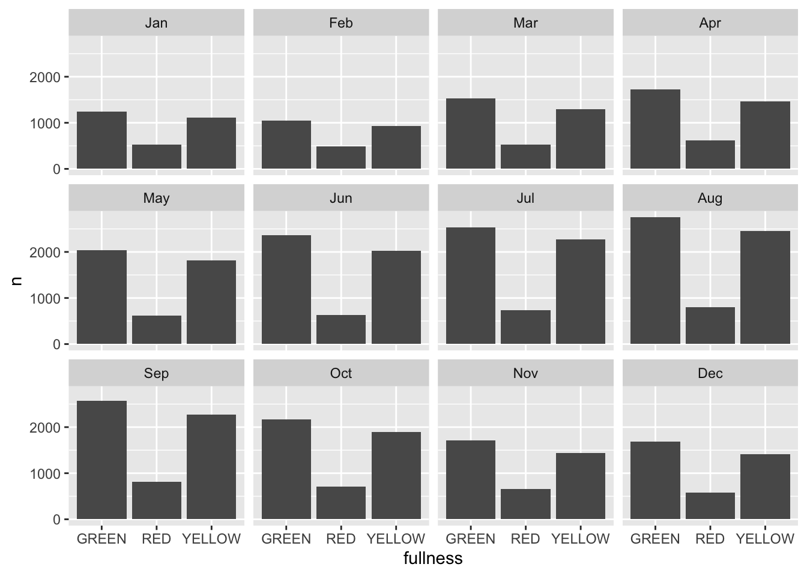
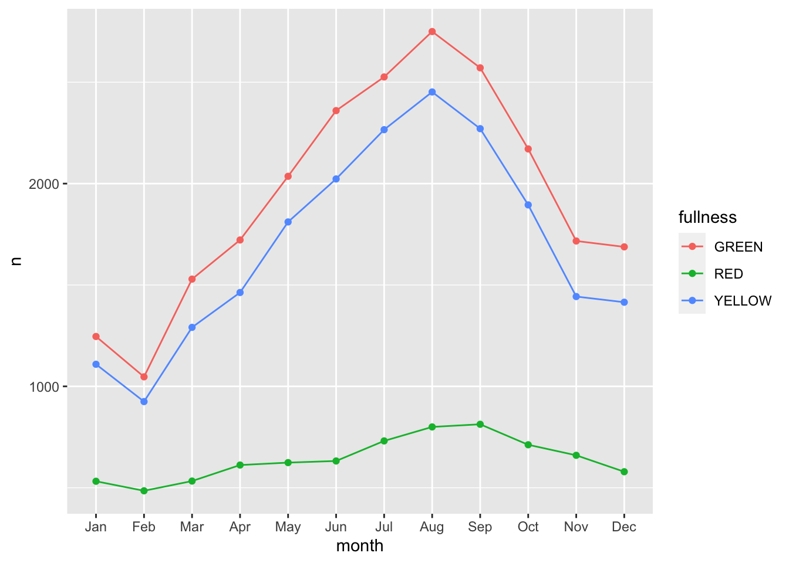

# Visualizing through time

Throughout this section, one type of visualization has been missing from our repetoire—the timeseries plot. This is because time series data is rather cumbersome to work with. Time series are unique because each observation represents some point in time. There is order inherent to the data. Because of this natural ordering of the data it makes the problem a bit trickier. But now that we have the visual tools and principles sorted out, we can apply them to time series data and visualize them as well. 

For this section we will work with the 2014 Big Belly data again. Our goal will be to visualize the reports by fullness over the course of the year. In this chapter we will first learn how to work with dates. Then we will use our new skills to aggregate our observations and view them over time. Next, we will discuss traditional methods of time series visualization. And finally we will quickly touch on the use of animation for viewing time-series. 

## Working with dates

The file that we will use is located at `data/big-belly-2014.csv`. Read in the dataset and assign it to the tibble `big_belly` and then preview it with `glimpse()`.


```r
library(tidyverse)

big_belly <- read_csv("data/big-belly-2014.csv")

glimpse(big_belly)
```

```
## Rows: 51,440
## Columns: 6
## $ description <chr> "Atlantic & Milk", "1330 Boylston @ Jersey Street", "SE B…
## $ timestamp   <dttm> 2014-01-01 00:41:00, 2014-01-01 01:19:00, 2014-01-01 01:…
## $ fullness    <chr> "YELLOW", "YELLOW", "YELLOW", "RED", "GREEN", "YELLOW", "…
## $ collection  <lgl> FALSE, FALSE, FALSE, FALSE, TRUE, TRUE, FALSE, TRUE, FALS…
## $ lat         <dbl> 42.35870, 42.34457, 42.34818, 42.34818, 42.34933, 42.3481…
## $ long        <dbl> -71.05144, -71.09783, -71.09744, -71.09744, -71.07702, -7…
```

What we can see is that the data are rather large and contains a column with the type `<dttm>` which is new to us. `<dttm>` is the way that a tibble represents a column of the type date time. 

> Note that the formal class for date time data is `POSIXct`. Working with date times with any computer is a tricky process. 

Date time objects follow the format of `YYYY-MM-DD HH:MM:SS` where `Y` is year, `M` month, `D` day, `H` hours, `M` minutes, and `S` seconds. 

This begs the question "how can we aggregate based on time?" The easiest way to do this is to group our observations by some interval. To do this we will solicit the help of the package [`lubridate`](https://lubridate.tidyverse.org). lubridate is part of the tidyverse, but it doesn't loadwith the tidyverse. As such, we will have to load the package ourselves. 


```r
library(lubridate)
```

```
## 
## Attaching package: 'lubridate'
```

```
## The following objects are masked from 'package:dplyr':
## 
##     intersect, setdiff, union
```

```
## The following objects are masked from 'package:base':
## 
##     date, intersect, setdiff, union
```

The package contains dozens of useful functions for working with dates in R. By no means will we go over each of them.

> To explore all of the functions in a package click on the `Packages` pane and search for the package you are interested in. Click the hyper link with the package name and then all of the exported functions and objects _should_ be documented there.

We will, however quickly touch on `ymd()`, `month()`, and `floor_date()`. 

The first is not useful in this example since `read_csv()` already parsed the column as a date time for us, but is important nonetheless. `ymd()` will convert a character string into a date object. The letters stand for _year_, _month_, and _date_. This function parses dates in the format of yup, you guessed it, year-month-day. For example:


```r
ymd("2020 01 20")
```

```
## [1] "2020-01-20"
```

```r
ymd("2020 jan. 20")
```

```
## [1] "2020-01-20"
```

```r
ymd("20, january-20")
```

```
## [1] "2020-01-20"
```

There are others such as `mdy()` and `dmy()` which you can use to parse dates as well. 

> The next time you are trying to parse a date think about the way it is formatted. Does the year precede or follow the month? 

Immediately useful to us is the `month()` function. This will extract the month component of a given date. 


```r
month("2020-01-01")
```

```
## [1] 1
```

The above returned the value of `1` because January is represented by 1. If we wished to return the full name of the month we set the argument `label = TRUE`.


```r
month("2020-01-01", label = TRUE)
```

```
## [1] Jan
## 12 Levels: Jan < Feb < Mar < Apr < May < Jun < Jul < Aug < Sep < ... < Dec
```

Furthermore, we can tell lubridate to not abbreviate the months by setting `abbr = FALSE`.


```r
month("2020-01-01", label = TRUE, abbr = FALSE)
```

```
## [1] January
## 12 Levels: January < February < March < April < May < June < ... < December
```

We can use the above function to extract the months from our Big Belly dataset. This will be extremely useful in aggregation. The one limitation, however, is that if there were another year present we would be grouping observations from both years into the the same month bucket. To avoid this, we can use the function `floor_date()`. `floor_date()` takes a date object and returns the closest date rounding down to a given unit. This may be best explained through an example. Given the date March 15th, 2020, let us round down to the near units `"week"`, `"month"`, and `"year"`.


```r
# create date object
mar_15 <- ymd("2020-03-15")

# round to week
floor_date(mar_15, unit = "week")
```

```
## [1] "2020-03-15"
```

```r
# round to month
floor_date(mar_15, unit = "month")
```

```
## [1] "2020-03-01"
```

```r
# round to year
floor_date(mar_15, unit = "year")
```

```
## [1] "2020-01-01"
```

With these new tools lets modify our `big_belly` tibble by creating two new columns `month` (with the labels) and `week` using `month()` and `floor_date()` respectively and assign the result to an object called `bb`. 


```r
bb <- big_belly %>% 
  mutate(
    month = month(timestamp, label = TRUE),
    week = floor_date(timestamp, unit = "week")
  )

slice(bb, 1:5)
```

```
## # A tibble: 5 x 8
##   description timestamp           fullness collection   lat  long month
##   <chr>       <dttm>              <chr>    <lgl>      <dbl> <dbl> <ord>
## 1 Atlantic &… 2014-01-01 00:41:00 YELLOW   FALSE       42.4 -71.1 Jan  
## 2 1330 Boyls… 2014-01-01 01:19:00 YELLOW   FALSE       42.3 -71.1 Jan  
## 3 SE Brookli… 2014-01-01 01:32:00 YELLOW   FALSE       42.3 -71.1 Jan  
## 4 SE Brookli… 2014-01-01 01:34:00 RED      FALSE       42.3 -71.1 Jan  
## 5 Huntington… 2014-01-01 02:10:00 GREEN    TRUE        42.3 -71.1 Jan  
## # … with 1 more variable: week <dttm>
```

## Standard visual approach

When we visualize time we need to consider how we humans cognitively and visually perceive time. Time is linear. It follow a path from start to end. Because of this we want to (almost) always plot our time dimension on the horizontal x axis as time proceeds forwards not up or down. Perhaps as a product of these restrictions there are not many variations on how we can visualize time. Two plots reign in time-series: the line and the bar plot. 

We can take our `bb` tibble and create a barchart of the total number of observations per month.


```r
count(bb, month) %>% 
  ggplot(aes(month, n)) +
  geom_col()
```


We can add a few more characters to the above code chunk so we can compare fullness over the months as well.


```r
count(bb, month, fullness) %>% 
  ggplot(aes(month, n, fill = fullness)) +
  geom_col()
```


Before we continue, we have to address the elephant in the room. We just made a plot with a legend that makes no sense. `GREEN` is mapped to red, `RED` is mapped to green, and `YELLOW` is mapped to blue. That's not good. We can fix this by adding manually mapping the color using one of the scale functions `scale_fill_manual(values = c("green", "red", "yellow"))`. Now back to the task at hand—time series. 

The stacked barchart above runs into the same limitations mentioned previously. And given the number of different time groups creating a dodged bar chart will become to cluttered by putting 36 total bars on there. We could consider faceting.


```r
count(bb, month, fullness) %>% 
  ggplot(aes(fullness, n, group = month)) +
  geom_col() + 
  facet_wrap("month")
```


This is okay, but again, still too cluttered. In this scenario we should consider the use of a line graph. The line graph is the de facto time series plot. The lines connect points in time. Achieving this with ggplot is rather straight forward. We will put our time dimension on the x axis and add the `geom_line()` layer. By default `geom_line()` doesn't know what points to connect to each other when there is more than one per x value. So in our case we need to tell ggplot which points to connect by setting the `group` aesthetic. Since we want to group together the lines by `fullness` level set `group` as well as `color` to `fullness`. We can step up the plotting game by also 


```r
count(bb, month, fullness) %>% 
  ggplot(aes(month, n, group = fullness, color = fullness)) +
  geom_line()
```



We can step up our plotting game by also adding a layer of points on top of the line to accentuate our lines.


```r
count(bb, month, fullness) %>% 
  ggplot(aes(month, n, group = fullness, color = fullness)) +
  geom_line() + 
  geom_point()
```


The three types are graphs are all that you may ever truly need when visualizing time. But sometimes it's nice to go over the top and add all of the frills. Often a dynamic visualization may be more persuasive than a static one.For this, we can use animation and the `gganimate` package. 

## Animation as time

In 2008 researchers at Microsoft and a scholar from Georgia Institute of Technology published a paper titled _Effectiveness of Animation in Trend Visualization_[^anim08]. This paper explored the reaction to a talk from 2006 which captured the attention of many by using animation to visualize global trends in health. That TED talk by Hans Rosling was a moving utilization of data visualization[^hans]. But why? This paper presented interactive and static visualizations to discover people's perspective on animation and its alternatives. They found that

> "users really liked the animation view: Study participants described it as "fun", "exciting", and even "emotionally touching." At the same time, though, some participants found it confusing: "the dots flew everywhere."[^anim08]

We now have scientific backing that animation is pretty good but also we're unsure—which seems to be in line with the rest of science. We will take the above quote as a measure of caution. That we _can_ creaate animations but also be careful with our use of them. For the remainder of this chapter we will learn about the the extension to ggplot2, gganimate. gganimate extends ggplot by extending the grammar to include elements pertaining solely to animation. 

When working with gganimate we need to think in the context of *frames*. Each frame will be a cross-section of our data. Or you can think of each frame a still in our film. In the context of time-series each frame will be our period of time. So if we continue with our Big Belly example above, each frame can be thought of as each month. 

To create animations we will need to install four packages: `gganimate`, `gifski` (what a brilliant name), `png`, and `transformr`. You can do so by running `install.packages(c("gganimate", "gifski", "png", "transformr"))`. 

For extending ggplot2, gganimate adds three main types of layers to ggplot. There are most importantly the `transition_*()`s and the `enter_*()` and `exit_*()` layers. In this chapter we will only address the `transition_*()` layers. The transitions will be used to move through our time dimension. For working with time data we will use `transition_states()` and `transition_reveal()`. These are best used with bar charts and line plot respectively. 


Since we will be changing our frames by our time dimension—`month` in this case—we start building our ggplot without it included. So, to create an animation of the counts by fullness by month we actually just start by visualizing the total counts. 


```r
(p <- count(bb, month, fullness) %>% 
  ggplot(aes(fullness, n)) +
  geom_col())
```


All that is needed to add animation to this plot is a transition layer. For the use of a bar chart we can use `transition_states(states)` where states is the unquoted name of the column that wil be transitioned through. 


```r
library(gganimate)

p + transition_states(month)  
```

<!-- -->

This is awesome! We've created an animation 😮. The bars change heigh with each change of state. The only bummer is that we don't know what states the animation is going through! When the animation is made there are four temporary variables made available for labeling. The documentation for `transition_states()` notes that the following variables are available[^transition-states]. 

* **transitioning** is a boolean indicating whether the frame is part of the transitioning phase
* **previous_state** The name of the last state the animation was at
* **closest_state** The name of the state closest to this frame
* **next_state** The name of the next state the animation will be part of

We can add a label layer to make this much more informative. To reference these variables we can use glue like quote strings with the above variables.


```r
p + 
  transition_states(month)  +
  labs(title = "{closest_state}")
```

<!-- -->


another fun way to do this is to make an animation. We can create an animation of our barchart where we transition through the different years.

Making an animation is as simple as adding an extra layer.

Before we do this we need to make sure we have the requisite packages 

please install the following make sure the below packages are available


- also need `transformr` to transition between points and lines


+
  transition_states(year, 
                    transition_length = 2,
                    state_length = 1) +
  ease_aes('sine-in-out') +
  labs(title = "Year: {closest_state}")

animate(annual_ecometrics, fps = 24, duration = 4)
```


```r
group_by(ecometrics, measure, year) %>% 
  summarise(n = sum(n)) %>% 
  ungroup() %>% 
  ggplot(aes(year, n, color = measure)) +
  geom_line() +
  geom_point() +
  transition_reveal(year)
```


[^anim08]: [Effectiveness of Animation in Trend Visualization](https://www.cc.gatech.edu/~stasko/papers/infovis08-anim.pdf)
[^hans]: [Hans Rosling](https://www.ted.com/talks/hans_rosling_the_best_stats_you_ve_ever_seen/transcript)
[^transition-states]: [`transition_states()`](https://gganimate.com/reference/transition_states.html)
