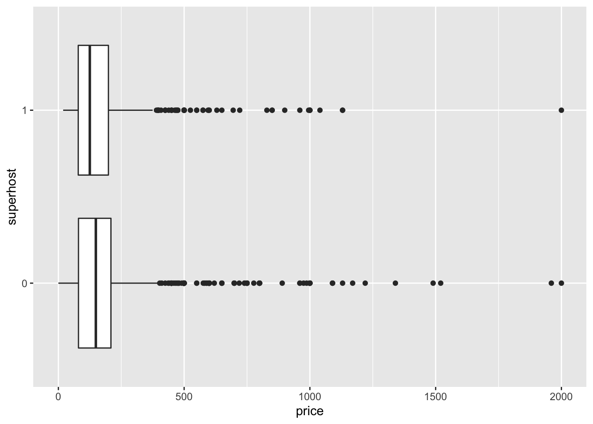

# Statistics


In the course of your analyses you will both want to and need to conduct statistical tests. It is important that you are equipped to perform these tests in R as well. Teaching you statistical concepts is outside of the scope of this book. For an introduction to statistical concepts using R, I recommend reading David Dalpiaz's free and open [_R for Statistical Learning_](https://daviddalpiaz.github.io/r4sl/)[^r4sl]. In this section we will review _how_ to implement statistical tests and extract useful information from them as well. We will cover t-tests, ANOVA, and linear regression.

To explore these statistics we will use data from Inside Airbnb. Of interest is the relationship between price and superhosts, price and room type, and finally how both superhosts and room type contribute to price. 

## The data

We will use data from both the `hosts` and `listings` datasets. The former contains superhost data while the later has both the price and room type information. First we will read in both of these datasets.  


```r
library(tidyverse)

listings <- read_csv("data/airbnb/listings.csv")
hosts <- read_csv("data/airbnb/hosts.csv")

glimpse(listings)
```

```
## Rows: 3,799
## Columns: 7
## $ id               <dbl> 3781, 5506, 6695, 8789, 10730, 10813, 10986, 16384, …
## $ neighborhood     <chr> "East Boston", "Roxbury", "Roxbury", "Downtown", "Do…
## $ room_type        <chr> "Entire home/apt", "Entire home/apt", "Entire home/a…
## $ price            <dbl> 125, 145, 169, 99, 150, 179, 125, 50, 154, 115, 148,…
## $ minimum_nights   <dbl> 28, 3, 3, 91, 91, 91, 91, 91, 29, 1, 2, 2, 2, 6, 3, …
## $ availability_365 <dbl> 68, 322, 274, 247, 29, 0, 364, 365, 304, 285, 62, 24…
## $ host_id          <dbl> 4804, 8229, 8229, 26988, 26988, 38997, 38997, 23078,…
```

```r
glimpse(hosts)
```

```
## Rows: 1,335
## Columns: 9
## $ id              <dbl> 4804, 8229, 26988, 38997, 23078, 71783, 85130, 85770,…
## $ name            <chr> "Frank", "Terry", "Anne", "Michelle", "Eric", "Lance"…
## $ since_year      <dbl> 2008, 2009, 2009, 2009, 2009, 2010, 2010, 2010, 2010,…
## $ since_month     <chr> "12", "02", "07", "09", "06", "01", "02", "02", "03",…
## $ since_day       <chr> "03", "19", "22", "16", "24", "19", "24", "26", "23",…
## $ response_rate   <chr> "100%", "100%", "100%", "92%", "50%", "98%", "66%", "…
## $ acceptance_rate <chr> "50%", "100%", "84%", "17%", "N/A", "98%", "97%", "10…
## $ superhost       <dbl> 1, 1, 1, 0, 0, 0, 0, 0, 0, 0, 0, 1, 0, 0, 0, 0, 0, 1,…
## $ n_listings      <dbl> 5, 2, 9, 13, 3, 40, 7, 4, 1, 2, 1, 1, 5, 1, 1, 1, 1, …
```

In order to join these two tibbles together we need to figure out what the common identifiers are. In `listings` we can infer that the **primary key** is `id` while the **foreign key** is `host_id`. While the `hosts` tibble only has one `id` column. Clearly the join needs to be between `host_id` and `id` from `listings` and `hosts` respectively. We will perform a left join then select the columns `price`, `room_type` and `superhost` and assign that to the object `airbnb`.


```r
airbnb <- left_join(listings, hosts, by = c("host_id" = "id")) %>% 
  select(price, room_type, superhost) 

glimpse(airbnb)
```

```
## Rows: 3,799
## Columns: 3
## $ price     <dbl> 125, 145, 169, 99, 150, 179, 125, 50, 154, 115, 148, 275, 2…
## $ room_type <chr> "Entire home/apt", "Entire home/apt", "Entire home/apt", "E…
## $ superhost <dbl> 1, 1, 1, 1, 1, 0, 0, 0, 0, 0, 0, 0, 0, 0, 1, 0, 1, 0, 0, 0,…
```

Before we can engage in any statistical testing we should do our due diligence and first visualize the relationship before we test it. Because we are comparing a group to a continuous variable a boxplot will suffice.


```r
ggplot(airbnb, aes(price, superhost, group = superhost)) +
  geom_boxplot()
```


> Note that we are setting the group to `superhost` this is because it is dummy coded as a numeric value. ggplot is attempting to consider it numeric rather than categorical. 

Clearly there are some noticeable outliers above the \$2,500 mark. Let's filter out these values before we get on to our testing and while we're at it, let's convert `superhost` to a factor with `factor()`. Save the the filtered results to `bnb_filt`. Recreate the above visualization with the new object.


```r
bnb_filt <- filter(airbnb, price < 2500) %>% 
  mutate(superhost = factor(superhost))

ggplot(bnb_filt, aes(price, superhost)) +
  geom_boxplot()
```



The first thing you may notices is that we no longer had to specify the `group` aesthetic because we converted `superhost` to a non-numeric format. From the above visualization it looks like that being a superhost does not necessarily increase the price of a listing. We can now test these means by using `t.test()`. There are a number of ways in which we can use this function but the most generalizable way is to use what is called the **formula** interface. 

## The formula interface 

The formula interface is a way of defining _statistical_ formulae. Or maybe a bit more clearly it let's us tell R which columns to use when fitting a model[^r4dummies]. The general format it takes is `y ~ x` which reads _y as a function of x_. In the case of a t-test the `y` is the variable that we will be testing the means of and the `x` is what group to compare. If our data are already in a tidy format—like our Airbnb data—this will be rather easy to adhere to. 

## T-tests

To perform a t-test we will use the `t.test()` function with the arguments `formula` and `data`. An example call looks like `t.test(y ~ x, data = df)`. In our case our `y` is `price` because it is our variable of interest or our dependent variable. Since we are curious how `price` changes by `superhost` status, we will put `superhost` in the `x` spot. 

Conduct a t-test and store the results in `price_t`. Print it out afterwards. 


```r
(price_t <- t.test(price ~ superhost, data = bnb_filt))
```

```
## 
## 	Welch Two Sample t-test
## 
## data:  price by superhost
## t = 2.3261, df = 2029.4, p-value = 0.02011
## alternative hypothesis: true difference in means is not equal to 0
## 95 percent confidence interval:
##   1.949967 22.904491
## sample estimates:
## mean in group 0 mean in group 1 
##        175.1989        162.7717
```
The above is a somewhat cluttered buch of numbers and words. But in there we can see our t-value (`t = 2.3261`), degrees of freedom (`df = 2029.4`), and our p-value (`p-value = 0.02011`). From this test we can tell that with an alpha level of 0.05 we can reject the null hypothesis. 

### Tidying up after our models

While this is useful, we're going to, at some point, want to extract these statistics in some usable format. Enter [`broom`](https://broom.tidyverse.org/). From the documentation:

> "`broom` summarizes key information about models in tidy tibble()s. broom provides three verbs to make it convenient to interact with model objects.
>
> * tidy() summarizes information about model components
* glance() reports information about the entire model
* augment() adds informations about observations to a dataset[^broom]

Make sure that broom is installed with `install.packages("broom")`. Once that is installed use the function `tidy()` on the `price_t` object,


```r
broom::tidy(price_t)
```

```
## # A tibble: 1 x 10
##   estimate estimate1 estimate2 statistic p.value parameter conf.low conf.high
##      <dbl>     <dbl>     <dbl>     <dbl>   <dbl>     <dbl>    <dbl>     <dbl>
## 1     12.4      175.      163.      2.33  0.0201     2029.     1.95      22.9
## # … with 2 more variables: method <chr>, alternative <chr>
```

The result is a tibble that can be easily manipulated and worked with. But naturally we will want to explore beyond just two groups. And in that case we must perform an analysis of variance (ANOVA).


## ANOVA

The ANOVA test is used in the case when t-tests cannot. That is, they are used when we want to know if there is a difference in means between groups when there are two or more groups. To perform an ANOVA we use the `aov()` function—an initialism for **a**analysis **o**f **v**ariance—with the same arguments that we used in `t.test()`. The only difference here is that the `x` is a column that has more than two groups—`room_type`. We can fit the ANOVA model with `price` as our `y` and `room_type` as our `x`.


```r
(price_aov <- aov(price ~ room_type, data = bnb_filt))
```

```
## Call:
##    aov(formula = price ~ room_type, data = bnb_filt)
## 
## Terms:
##                 room_type Residuals
## Sum of Squares   15152015  70853604
## Deg. of Freedom         3      3789
## 
## Residual standard error: 136.7473
## Estimated effects may be unbalanced
```

When we print out the ANOVA model object we actually don't see the results we were anticipating. To get thos we have to pass the model object to the function `summary()`.


```r
summary(price_aov)
```

```
##               Df   Sum Sq Mean Sq F value Pr(>F)    
## room_type      3 15152015 5050672   270.1 <2e-16 ***
## Residuals   3789 70853604   18700                   
## ---
## Signif. codes:  0 '***' 0.001 '**' 0.01 '*' 0.05 '.' 0.1 ' ' 1
```
 
 Now here we find the results of our test: p < 0.001. You may notice already that there is some inconsistency in which that ways that models are interacted with. That is why we use broom, to have one common way of working with model objects. If we'd like to access the model results in a consistent way we can again use `broom::tidy()`.
 

```r
broom::tidy(price_aov)
```

```
## # A tibble: 2 x 6
##   term         df     sumsq   meansq statistic    p.value
##   <chr>     <dbl>     <dbl>    <dbl>     <dbl>      <dbl>
## 1 room_type     3 15152015. 5050672.      270.  7.32e-159
## 2 Residuals  3789 70853604.   18700.       NA  NA
```
 
 Remember though that ANOVA tests if there is _any_ variation between any two groups. The results of the test do not tell us _which_ groups are different. And this is when we turn to Tukey's Honestly Significant Difference (HSD). Tukey's HSD creates a set of confidence intervals to compare each unique combination of our variables. To perform the test in R we pass the ANOVA model object to the function `TukeyHSD()`
 

```r
(price_hsd <- TukeyHSD(price_aov))
```

```
##   Tukey multiple comparisons of means
##     95% family-wise confidence level
## 
## Fit: aov(formula = price ~ room_type, data = bnb_filt)
## 
## $room_type
##                                     diff        lwr         upr     p adj
## Hotel room-Entire home/apt    -74.062500 -130.09198  -18.033019 0.0038353
## Private room-Entire home/apt -132.658355 -144.68495 -120.631764 0.0000000
## Shared room-Entire home/apt  -123.687500 -211.84397  -35.531026 0.0017890
## Private room-Hotel room       -58.595855 -115.00228   -2.189435 0.0381673
## Shared room-Hotel room        -49.625000 -153.58946   54.339462 0.6097851
## Shared room-Private room        8.970855  -79.42567   97.367379 0.9937854
```
The results of the above test show that there are rather significant difference between hotel rooms and entire homes or apartments, private rooms and entire homes, shared rooms and entire homes, as well as private room and hotel room. With the use of broom and ggplot we can begin to visualize these restuls.


```r
(price_hsd_tidy <- broom::tidy(price_hsd))
```

```
## # A tibble: 6 x 6
##   term      comparison                   estimate conf.low conf.high adj.p.value
##   <chr>     <chr>                           <dbl>    <dbl>     <dbl>       <dbl>
## 1 room_type Hotel room-Entire home/apt     -74.1    -130.     -18.0      3.84e-3
## 2 room_type Private room-Entire home/apt  -133.     -145.    -121.       1.38e-8
## 3 room_type Shared room-Entire home/apt   -124.     -212.     -35.5      1.79e-3
## 4 room_type Private room-Hotel room        -58.6    -115.      -2.19     3.82e-2
## 5 room_type Shared room-Hotel room         -49.6    -154.      54.3      6.10e-1
## 6 room_type Shared room-Private room         8.97    -79.4     97.4      9.94e-1
```

With the tidied HSD object we can create a graph of point estimates and error bars. 

> I personally like to call these Tie Fighter plots because they resemble the space ships from Star Wars. 

We can being by plotting the point estimates of each comparison. 


```r
(p <- ggplot(price_hsd_tidy, aes(estimate, comparison)) +
  geom_point())
```


Next we can add a horizontal error bar (`geom_errorbarh()`) layer to the plot. This layer requires some additional aesthetics that we will set in the layer itself. These are `xmin` and `xmax`. Respectively they are used to mark the minimum and maximum extents of the error bars. In the case of the HSD object, the bounds of th confidence intervals have been already calculated for us and can be found in the columns `conf.low` and `conf.high`. We can pass these to the `xmin` and `xmax` aesthetic arguments.


```r
p +
  geom_errorbarh(aes(xmin = conf.low, xmax = conf.high))
```


## Linear regression

When we want to move on to inference with linear models, we turn to the `lm()` function. This, like the `t.test()` and `aov()` functions requires both a formula and data. The difference is that the formulas that we will use are a bit more complex because we will often be using many variables. To predict y as some function of multiple inputs we have to declare all of those inputs in our formula which takes form of `y ~ x1 + x2 + ...`. So if we were to create a linear model that predicts price as a function of room type and whether or the host is a superhost, our formula will look like `price ~ room_type + superhost`. 


```r
price_lm <- lm(price ~ room_type + superhost, data = bnb_filt)

summary(price_lm)
```

```
## 
## Call:
## lm(formula = price ~ room_type + superhost, data = bnb_filt)
## 
## Residuals:
##     Min      1Q  Median      3Q     Max 
## -219.01  -64.01  -26.01   20.99 1780.99 
## 
## Coefficients:
##                        Estimate Std. Error t value Pr(>|t|)    
## (Intercept)            219.0073     3.0450  71.925  < 2e-16 ***
## room_typeHotel room    -74.3532    21.8938  -3.396 0.000691 ***
## room_typePrivate room -132.7222     4.7004 -28.237  < 2e-16 ***
## room_typeShared room  -123.5526    34.3168  -3.600 0.000322 ***
## superhost1               0.7244     4.9720   0.146 0.884172    
## ---
## Signif. codes:  0 '***' 0.001 '**' 0.01 '*' 0.05 '.' 0.1 ' ' 1
## 
## Residual standard error: 136.8 on 3788 degrees of freedom
## Multiple R-squared:  0.1762,	Adjusted R-squared:  0.1753 
## F-statistic: 202.5 on 4 and 3788 DF,  p-value: < 2.2e-16
```
The output of this is very similar to that of the ANOVA model. Perhaps we can visualize it the same way? 


```r
broom::tidy(price_lm)
```

```
## # A tibble: 5 x 5
##   term                  estimate std.error statistic   p.value
##   <chr>                    <dbl>     <dbl>     <dbl>     <dbl>
## 1 (Intercept)            219.         3.04    71.9   0.       
## 2 room_typeHotel room    -74.4       21.9     -3.40  6.91e-  4
## 3 room_typePrivate room -133.         4.70   -28.2   2.34e-159
## 4 room_typeShared room  -124.        34.3     -3.60  3.22e-  4
## 5 superhost1               0.724      4.97     0.146 8.84e-  1
```

Unfortunately when we tidy this up we don't have the same columns. However we can ask for them explicitly by setting the argument `conf.int = TRUE`. 

> You can find all possible arguments for `tidy()` in the exported object `broom::argument_glossary`. 

Using a similar structure as above, we can create a coefficient plot.


```r
broom::tidy(price_lm, conf.int = TRUE) %>% 
  ggplot(aes(estimate, term)) +
  geom_point() + 
  geom_errorbarh(aes(xmin = conf.low, xmax = conf.high))
```


Unlike the t-test, a linear model provides much more information that will become useful such as goodness of fit measures, residuals, and predicted values. To extract these we can use the functions `glance()` and `augment()` from broom.


```r
broom::glance(price_lm)
```

```
## # A tibble: 1 x 11
##   r.squared adj.r.squared sigma statistic   p.value    df  logLik    AIC    BIC
##       <dbl>         <dbl> <dbl>     <dbl>     <dbl> <int>   <dbl>  <dbl>  <dbl>
## 1     0.176         0.175  137.      203. 1.29e-157     5 -24035. 48081. 48118.
## # … with 2 more variables: deviance <dbl>, df.residual <int>
```

```r
broom::augment(price_lm) %>% 
  slice(1:5)
```

```
## # A tibble: 5 x 10
##   price room_type superhost .fitted .se.fit .resid    .hat .sigma .cooksd
##   <dbl> <chr>     <fct>       <dbl>   <dbl>  <dbl>   <dbl>  <dbl>   <dbl>
## 1   125 Entire h… 1            220.    4.66  -94.7 0.00116   137. 1.12e-4
## 2   145 Entire h… 1            220.    4.66  -74.7 0.00116   137. 6.94e-5
## 3   169 Entire h… 1            220.    4.66  -50.7 0.00116   137. 3.20e-5
## 4    99 Entire h… 1            220.    4.66 -121.  0.00116   137. 1.81e-4
## 5   150 Entire h… 1            220.    4.66  -69.7 0.00116   137. 6.04e-5
## # … with 1 more variable: .std.resid <dbl>
```


[^r4sl]: _R for Statistical Learning_. https://daviddalpiaz.github.io/r4sl/.
[^r4dummies]: _R for Dummies_. https://www.dummies.com/programming/r/how-to-use-the-formula-interface-in-r/. 
[^broom]: {broom} https://broom.tidyverse.org/. 
